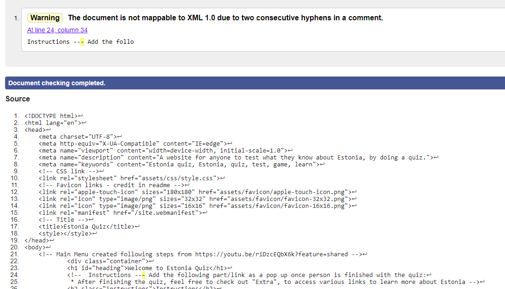
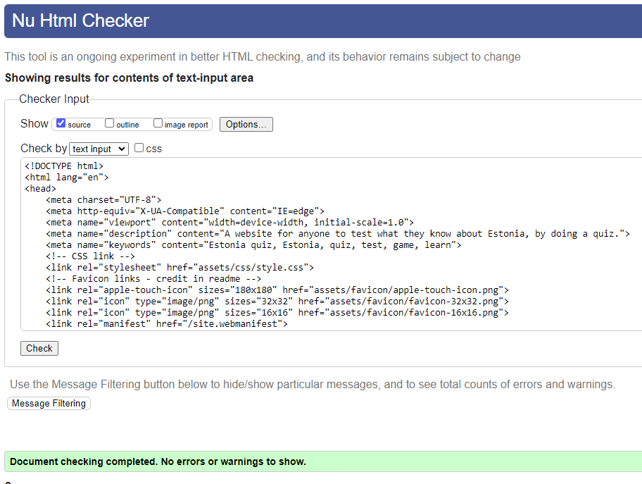
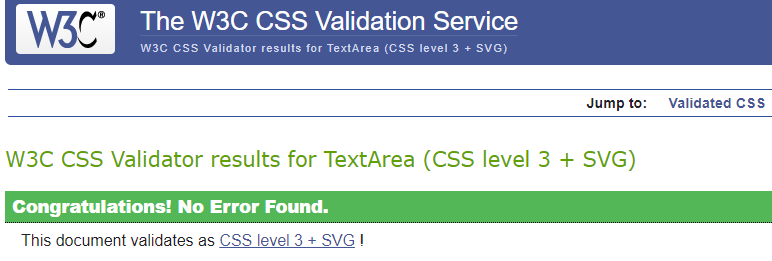
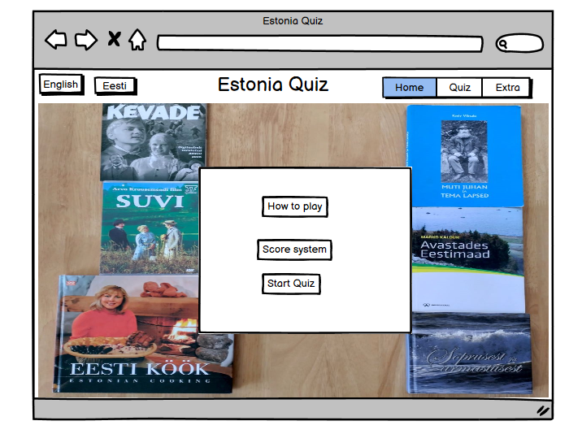
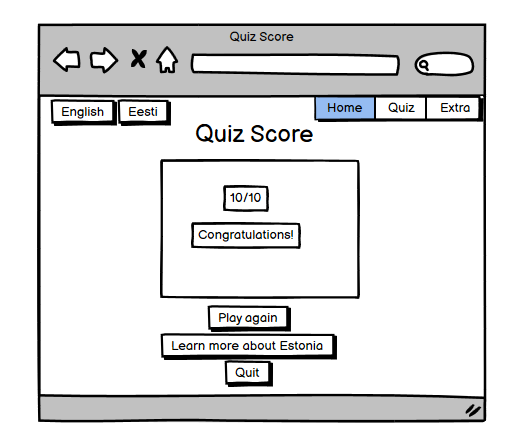
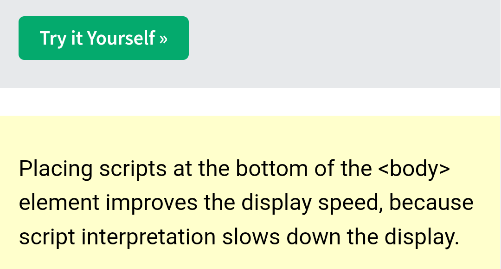

# Estonia Quiz

Estonia quiz has been created by Software Development student, as part of Code Institute's Javascript project. This quiz is for anyone who would like to test their knowledge about Estonia. Developer had planned to include an Extra part for this website, where visitors could find out more about Estonia, and see the research done by the developer for creating questions and answers for the quiz. Due to developer being a beginner in coding, this extra link is part of the website for now is included in the README file instead of a button on the website. 

Link to the live site: https://barbykelly.github.io/Estonia-Quiz/

...image of my website on different gadgets ... place here...from am I responsive.

## __Contents__

* [User Experience](#user-experience)
  * [User Stories](#user-stories)

* [Wireframes](#wireframes)

* [Design](#design)
  * [Images](#images)
  * [Color](#color)
  * [Font/Style](#fontstyle)

* [Features](#features)

  * [Existing Features](#existing-features)

  * [Future Features](#future-features)
  
* [Languages Used](#languages-used)

* [Sites, Apps Used](#sites-apps-used)

* [Testing](#testing)

* [Bug fixing](#bug-fixing)

* [Known Bugs](#known-bugs)

* [Deployment](#deployment)

* [Credits](#credits)
  * [Code](#code)
  * [Questions](#questions)
  * [Images](#images)

* [Acknowledgements](#acknowledgements)

## User Experience

### User Stories

#### First Time User:

As a first time user, I want to:

* Check my knowledge about Estonia.

* Learn something new about Estonia.

* Click on tabs.

* See that everything works on the website.

#### Returning User:

As a returning user I want to:

* See different quiz options.

* Test my knowledge again.

* See updated info on the website.

* Improve my score. (Part of Future development, to keep scores?)

* See that all of the links work.

[Back to top](#contents)

## Website Structure
This website includes one page where different areas can be accessed via buttons.
- Welcome and Instructions area with buttons,
- Quiz area with buttons,

### Wireframes

* This website is for anyone interested in doing a quiz, or who wants to learn more about Estonia.

* Goal of the quiz is to:
  * test knowledge
  * play a game
  * get a score
  * see score on the page
  * try quiz again
  * see the correct answers

* Website visitors are likely to:
  * click on "Start quiz"
  * read the questions
  * answer the questions
  * want to see their score
  * try again by clicking on "Restart Quiz"
  * click on buttons, links and images
  * click on "Extra" (Part of the Future development)
  

  Screenshot of Estonia Quiz Home Page with the original image idea, with Estonian books and DVD's, Wireframes:

  Screenshot of Estonia Quiz "Quiz Score" view, Wireframes

Buttons top left, languages:
  * English
  * Eesti (Estonian)
(Part of Future Development plan due to time constraint, and developer being a beginner in coding)

[Back to top](#contents)

## Design

### Images

* FAVICON

Developer used an image of a cornflower (Estonian national flower), from her own collection, to create a Favicon.

The original image: 

This website helped to convert the image into Favicon:
https://favicon.io/favicon-converter/

Screenshot of favicon on the website:

### Color
* As Estonian national flower is a Cornflower, developer chose 'cornflower blue' as a Background color for the website. Developer found Cornflower blue color code from this website: 
https://htmlcolorcodes.com/colors/cornflower-blue/

* Color palette from this website:
https://mycolor.space/?hex=%236495ED&sub=1

...Natural Palette or Neighbor Palette, which suits better. Add screenshot then of the palette used...

### Font/style

[Back to top](#contents)

## Features

### Existing Features 

.....

### Future Features

* Add variations of the quiz eg wildlife, culture, music, authors, movies, national symbols and so on.

* Add difficulty levels: easy, medium, difficult (credit: difficulty levels were suggested by developer's older child)

* Add language Buttons on top, to be able to do the quiz in different languages:
  * English
  * Eesti (Estonian)

* Add Extra section/button to the website. On this area of the page Visitors can click on links to learn more about Estonia, and see research done by the Developer while searching for questions and answers for the quiz.

* Add code to make images showing the correct answer (eg picture of lynx) to pop up, when visitor has made their answer choice.

[Back to top](#contents)

## Languages Used

...add image from github before submitting, list of html, css, javascript, other

[Back to top](#contents)

## Sites, Apps Used

Developer used these sites to create Estonia Quiz project: 

* Balsamiq Wireframes
* Github
* VS Code
* Code Institute

.... add links to all?

[Back to top](#contents)

## Testing

* Throughout the project testing HTML for errors and fixing errors.

### HTML

Tested HTML on this website:
https://validator.w3.org/nu/#textarea

Result after fixing the error and retesting:

### css

Tested on this website:
https://jigsaw.w3.org/css-validator/validator

### Javascript

...on different browsers
...lighthouse
...inspect
... readme links 
...readme content list links

[Back to top](#contents)

## Bug fixing

* Favicon

At first favicon icon did not appear on the website. Developer had used the four line code from favicon.io
https://favicon.io/favicon-converter/

After comparing Favicon codes to the codes from Love Running, developer noticed that path needed to be adjusted. After adjusting the path, favicon appeared on the website. 

* HTML error

- Developer saw this error when inspecting the website: "Uncaught TypeError: startQuizBtn is not a function at HTMLButtonElement.onclick".

- Developer found the solution after reading this article: https://stackoverflow.com/questions/51282433/typeerror-functionname-is-not-a-function-at-htmlbuttonelement-onclick

- Error had been caused by startQuizBtn, were it was supposed to be startQuizBtnFunction instead.

[Back to top](#contents)

## Known Bugs
...if not showing properly on some sites/phones

[Back to top](#contents)

## Deployment

1. Developer clicked on this link https://github.com/Code-Institute-Org/ci-full-template under Love Maths "Getting Set Up" video.

2. As the original template was for CodeAnywhere, and developer works with github, developer clicked on https://github.com/Code-Institute-Org/gitpod-full-template

3. Developer clicked on "Use this template", and then clicked on "Create a new repository":

4. Filled in Repository name, and clicked on "Create repository"

[Back to top](#contents)

## Credits

* Favicon 

  * Favicon created using
https://favicon.io/favicon-converter/

  * These 3 lines of code, for favicon, were copied from Love Running:
  <link rel="apple-touch-icon" sizes="180x180" href="assets/favicon/apple-touch-icon.png">
  <link rel="icon" type="image/png" sizes="32x32" href="assets/favicon/favicon-32x32.png">
  <link rel="icon" type="image/png" sizes="16x16" href="assets/favicon/favicon-16x16.png">

  * This line of code:
  <link rel="manifest" href="/site.webmanifest"> 
  for Favicon, was copied from
  https://favicon.io/favicon-converter/

* Coding Group member Patrick Hladun for guiding developer via Slack, to get console errors to show up, and how to track errors one by one. He also pointed out where names of the functions were clashing, and some ; vs : errors in developer's code.

* Readme

  * Parts of the Readme template used from:
   https://github.com/Code-Institute-Solutions/SampleREADME?tab=readme-ov-file 

   and https://github.com/Tony118g/the-everything-quiz/blob/main/README.md 

   Reading The Everything Quiz README, highlighted for me the level of details that Quiz website README needs.

* User Stories:
  Template used from:
  https://www.atlassian.com/agile/project-management/user-stories

* Wirefames

  * Ideas, how to articulate user's goals, written down after reading this article: https://balsamiq.com/learn/articles/five-steps-to-great-wireframes/

 * 

  Learned how to use Wirefame from this video:
  https://www.youtube.com/watch?v=9Pv002d0Kls&list=PLVlyYfbClWxQDCGC-A1FkbGyIxtuIN5IM&index=1

  * Screenshot of Estonia Quiz home page, created with Balsamiq Wireframes:

  * 
  
  * Screenshot of Estonia Quiz test score page, created with Balsamiq Wireframes:

  * 

  * Screenshot of Estonia Quiz Extra page, created with Balsamiq Wireframes:

* Script
  Developer learned how page is loading faster, if scripts are placed at the bottom of the body in html, from this site:
  [w3 schools website](https://www.w3schools.com/js/js_whereto.asp)
  

* How to make quiz learned from various YouTube videos, mentioned in code. Main credit for creating a quiz template goes to Leeds Quiz: https://github.com/andreas-ka/leeds-quiz .

* Grateful to my Mentor Lauren-Nicole for supporting me with my projects, and for sharing example quizzes like the Leeds Quiz.

* Thank you to Laura Mayock, group's Cohort Facilitator, for our weekly group meetings and guidance, encouraging students to show and talk about their    projects. And to everyone who took part of the group meetings, shared their projects, or who supported fellow students via Slack. 

* Footer
  Developer learned how to make Copyright sign &copy; from this project:
  [Mental-Arithmetic-Quiz project](https://github.com/Shida18719/Mental-Arithmetic-Quiz/blob/main/index.html)

### Code

* Base for Estonia Quiz html, css and javaScript code from: 
https://github.com/andreas-ka/leeds-quiz

### Questions

* All of the questions created by the developer, from her own experience, knowledge or researching updated information.

place here the pop up answer images , links!!!!

### Images 

* Website's background image taken by the developer.

* Same background image used to create a favicon image. .... place link for favicon how did it...

[Back to top](#contents)

### Acknowledgements
...Slack, mentor, YouTube video?, if they are already under credit? friends and family for testing the quiz

[Back to top](#contents)

/* Links/research for future development: 

All of the Questions created by the Developer. All of the links and research to support the validity of the questions/answers, readme gathered by the developer. */

/* Future dev: Correct answer to be made hidden, and then pop up for all of the questions,
with image and link on the side, or on the extra page? Add links to readme, and images, or only here? make answer images
as part of a comment for now, until correct code, where to place them
Estonia-Quiz/questions/northerneurope.png
Screenshot from this website:
https://gisgeography.com/europe-map/ */

/* Future dev: Estonia-Quiz/questions/estonianflag.png  
Estonia-Quiz/questions/flagstory.png
Link to image of Estonia, with the story about Estonian flag colours, used from this website:
https://www.visitestonia.com/en//estonian-flag */

/* Future dev: Add link to visit Estonia, inside the question/answer brackets or separate? */

/* Future dev: add image of English Estonian keyboard incidents */

/* Future dev: add https://www.eesti.ee/en/republic-of-estonia/republic-of-estonia/state-insignia. 

assets/images/nationalbird.png */

/* Future dev: Add image of a lynx. Credit where got the image.
https://www.visitestonia.com/en/lynx-and-bear-watching-tour-in-alutaguse-and-lahemaa-national-park?gad_source=5&gclid=EAIaIQobChMI5f2Whpa_gwMVhJhQBh28dgSrEAAYASAAEgIPl_D_BwE */

/* Future dev, add to answer/extra: https://www.stat.ee/en/find-statistics/statistics-theme/population */

/* Future dev or now: add explanation, as due to cov it changed for few years, info from this website:
https://www.visitestonia.com/en/why-estonia/welcome-to-the-estonian-song-and-dance-celebration
due to covid, after 4 years this time:
Estonia-Quiz/questions/differentyears.png 

 */

/* Future dev add: You can watch this to hear numbers in Estonian: https://youtube.com/shorts/y2RQWWda-Nc?feature=shared */

