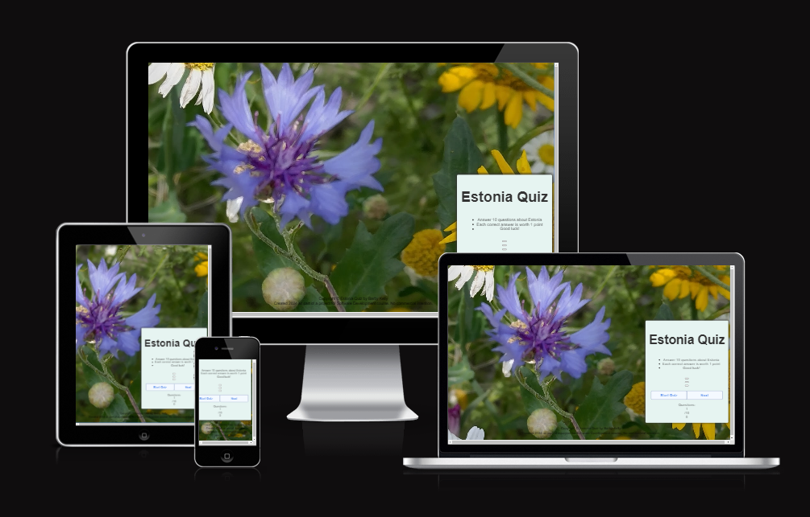
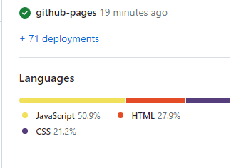
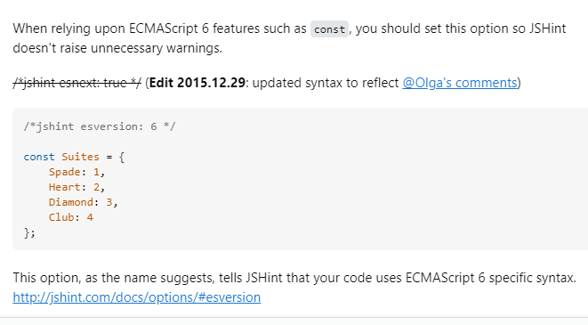
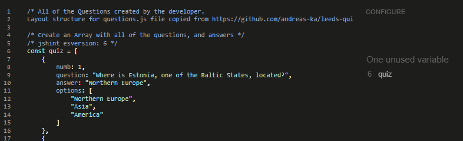
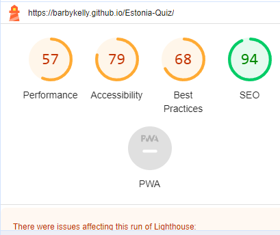

# Estonia Quiz 

Estonia quiz has been created by a Software Development student, as part of Code Institute's Javascript project. This quiz is for anyone who would like to test their knowledge about Estonia. 

Link to the live site: [Estonia Quiz](https://barbykelly.github.io/Estonia-Quiz/)

Image from [Am I Responsive?](https://ui.dev/amiresponsive?url=https://barbykelly.github.io/Estonia-Quiz/) to show how website looks on different screen sizes.

## Contents

[User Experience](#user-experience)
  - [User Stories](#user-stories)

[Wireframes](#wireframes)

[Design](#design)
  - [Images](#images)
  - [Color](#color)
  - [Font/Style](#fontstyle)

[Features](#features)

  - [Existing Features](#existing-features)

  - [Future Features](#future-features)
  
[Languages Used](#languages-used)

[Sites, Apps Used](#sites-apps-used)

[Testing](#testing)

[Bug fixing](#bug-fixing)

[Known Bugs](#known-bugs)

[Deployment](#deployment)

[Credits](#credits)
  - [Code](#code)
  - [Questions](#questions)
  - [Images](#images)

[Acknowledgements](#acknowledgements)

## User Experience

### User Stories

#### First Time User:

First time user, may want to:

- Check their knowledge about Estonia.

- Learn something new about Estonia.

- Click on tabs.

- See that everything works on the website.

#### Returning User:

Returning user may want to:

- See different quiz options.

- Test their knowledge again.

- See updated info on the website.

- Improve their score.

- See that all of the links work.

[Back to top](#contents)

## Website Structure

This website includes one page where different areas can be accessed via buttons.
- Welcome and Instructions area with buttons,
- Quiz area with buttons.

### Wireframes

This website is for anyone interested in doing a quiz, or who wants to learn more about Estonia.

Goal of the quiz is to:
  - test knowledge
  - play a game
  - get a score
  - see score on the page
  - try quiz again
  - see the correct answers

Website visitors are likely to:
  - click on "Start quiz"
  - read the questions
  - answer the questions
  - want to see their score
  - try again by clicking on "Restart Quiz"
  - click on buttons, links and images

Screenshot of Estonia Quiz Home Page with the original image idea, with Estonian books and DVD's, Wireframe:

Screenshot of Estonia Quiz "Quiz Score" view, Wireframe

Buttons top left, languages:
  - English
  - Eesti (Estonian)
(Part of Future Development plan due to time constraint, and developer being a beginner in coding)

[Back to top](#contents)

## Design

### Images

FAVICON

Developer used an image of a cornflower (Estonian national flower), from her own collection, to create a Favicon.

The original image: 

[Favicon.io](https://favicon.io/favicon-converter/) helped to convert the image into Favicon:

Screenshot of favicon on the website:

### Color

As the Estonian national flower is a Cornflower, developer chose 'cornflower blue' as a Background color for the website. Developer found Cornflower blue color code from this website: 

Color palette from this website:
[Mycolor.space](https://mycolor.space/?hex=%236495ED&sub=1)

### Font/style

[Back to top](#contents)

## Features

### Existing Features 

- Background image of Estonian national flower, cornflower
- Estonia Quiz instructions
- Start Quiz button
- Next button
- Restart Quiz button
- Ten questions
- How many questions answered indicator
- Footer with copyright sign
- Favicon

### Future Features

- Add variations of the quiz eg wildlife, culture, music, authors, movies, national symbols and so on.

- Add difficulty levels: easy, medium, difficult (credit: difficulty levels were suggested by developer's older child)

- Add language Buttons on top, to be able to do the quiz in different languages:
  - English
  - Eesti (Estonian)

- Add "Extra" button to the website, which would bring visitors to an area with links and images to find out more about Estonia 

- Add code to make images pop up when visitor has made their choice. Image of the correct answer (eg picture of lynx)

- Get all buttons to work in different browsers/ports

- STyle Instructions area

[Back to top](#contents)

## Languages Used

[Back to top](#contents)

## Sites, Apps Used

Developer used these sites/apps to create Estonia Quiz project: 

- [Balsamiq Wireframes](https://balsamiq.com/)
- [GitHub](https://github.com/)
- [Gitpod]()

[Back to top](#contents)

## Testing

### HTML

Tested HTML with
[Validator.W3](https://validator.w3.org/nu/#textarea)

Result after fixing the error and retesting:

### css

Tested CSS with

[Jigsaw.W3](https://jigsaw.w3.org/css-validator/validator) delete this?

### JavaScript

[Site 24X7](https://www.site24x7.com/tools/javascript-validator.html) - used 26.07

Tested JavaScript with [JSHint](https://jshint.com/)

Warning showed up for 'const':

The developer found from [here](https://stackoverflow.com/questions/27441803/why-does-jshint-throw-a-warning-if-i-am-using-const) how to modify jshint alert:

After adding the suggested code, alert for 'const' was solved:

### Lighthouse

Tested with Lighthouse:

[Back to top](#contents)

## Bug fixing

### Favicon

At first favicon icon did not appear on the website. Developer had used the four line code from
[Favicon.io](https://favicon.io/favicon-converter/)

After comparing Favicon codes to the codes from Love Running, developer noticed that path needed to be adjusted. After adjusting the path, favicon appeared on the website. 

### HTML error

Developer saw the following error when inspecting the website: "Uncaught TypeError: startQuizBtn is not a function at HTMLButtonElement.onclick".

Developer found the solution after reading this [article](https://stackoverflow.com/questions/51282433/typeerror-functionname-is-not-a-function-at-htmlbuttonelement-onclick)

Error had been caused by startQuizBtn, were it was supposed to be startQuizBtnFunction instead.

[Back to top](#contents)

## Known Bugs

- Start Quiz button not working on developer's port. Port error showing  up. 

- The developer was unable to check how questions and answers show up on the website, since the Start Quiz button stopped working. The developer searched for help via Slack, on Google, from mentor and tutor, other coders, and so far did not manage to fix it.

- Instructions styling seemed to be not responsive.

[Back to top](#contents)

## Deployment

Developer is sharing steps to creating a repo:
1. Developer clicked on this [GitHub link](https://github.com/Code-Institute-Org/ci-full-template) under Love Maths "Getting Set Up" video.

2. As the original template was for CodeAnywhere, and developer works with GitHub, developer clicked on [GitPod template](https://github.com/Code-Institute-Org/gitpod-full-template)

3. Next the developer clicked on "Use this template", and then clicked on "Create a new repository":

4. Filled in Repository name, and clicked on "Create repository"

5. Deployed using GitHub

[Back to top](#contents)

## Credits

### Favicon 

Favicon created using [favicon converter](https://favicon.io/favicon-converter/)

These 3 lines of code, for favicon, were copied from Love Running:
<link rel="apple-touch-icon" sizes="180x180" href="assets/favicon/apple-touch-icon.png">
<link rel="icon" type="image/png" sizes="32x32" href="assets/favicon/favicon-32x32.png">
<link rel="icon" type="image/png" sizes="16x16" href="assets/favicon/favicon-16x16.png">

This line of code:
<link rel="manifest" href="/site.webmanifest"> 
for Favicon, was copied from
https://favicon.io/favicon-converter/

Rest of the code credited in index.html, script.js, questions.js, style.css and in other parts of README.

### Readme

Parts of the Readme template used from [Code Institute's Sample README](https://github.com/Code-Institute-Solutions/SampleREADME?tab=readme-ov-file) 

The Contents menu learned from: [Everything Quiz](https://github.com/Tony118g/the-everything-quiz/blob/main/README.md) 

Reading The Everything Quiz README, highlighted for the developer the level of details that Quiz website README needs, and the importance of the README. 

### User Stories:
Template used from
[Atlassian.com](https://www.atlassian.com/agile/project-management/user-stories)

### Wirefames

- Ideas, how to articulate user's goals, written down after reading this [article](https://balsamiq.com/learn/articles/five-steps-to-great-wireframes/)

- The developer learned how to use Wirefames from [this Youtube video](https://www.youtube.com/watch?v=9Pv002d0Kls&list=PLVlyYfbClWxQDCGC-A1FkbGyIxtuIN5IM&index=1)

- Screenshot of Estonia Quiz home page, created with Balsamiq Wireframes:

Photo taken by the developer. Developer opted for Cornwlower image in the end, as it looked better and was more meaningful for the website to have the national flower of Estonia.
  
- Screenshot of Estonia Quiz test score page, created with Balsamiq Wireframes:

### Code

Base for Estonia quiz from [Leeds Quiz](https://github.com/andreas-ka/leeds-quiz). Developer watched various YouTube quiz tutorials, and kept returning to Leeds Quiz, as developer liked the style of that quiz.

- Script

Developer learned how page is loading faster, if scripts are placed at the bottom of the body in html from [W3 schools website](https://www.w3schools.com/js/js_whereto.asp)
  

- Footer

Developer learned how to make Copyright sign &copy; from [Mental-Arithmetic-Quiz project](https://github.com/Shida18719/Mental-Arithmetic-Quiz/blob/main/index.html)

### Questions

All of the questions created by the developer, from her own experience, her own knowledge or researching updated information eg population details. 

Below are the websites/images that developer used to validate the answers for the Estonia quiz:

- Northern Europe, screenshot from [gisgeography.com](https://gisgeography.com/europe-map/)

- Estonia-Quiz/questions/flagstory.png
[Flag story]

- [eesti.ee](https://www.eesti.ee/en/republic-of-estonia/republic-of-estonia/state-insignia)

- Estonian national bird: 

- [lynx watching tour](https://www.visitestonia.com/en/lynx-and-bear-watching-tour-in-alutaguse-and-lahemaa-national-park?gad_source=5&gclid=EAIaIQobChMI5f2Whpa_gwMVhJhQBh28dgSrEAAYASAAEgIPl_D_BwE)

- Population statistics from
[stat.ee](https://www.stat.ee/en/find-statistics/statistics-theme/population)

- Due to covid, festival is after 4 years this time

 

Usually every 5 years [the Estonian Song and Dance Festival](https://www.visitestonia.com/en/why-estonia/welcome-to-the-estonian-song-and-dance-celebration)

- To hear numbers in Estonian, visitor can watch this [Youtube video](https://youtube.com/shorts/y2RQWWda-Nc?feature=shared)

### Images 

Website's background image, cornflower, and the image with Estonian books and DVD's (wireframe), both taken by the developer.

Same background image used to create a favicon image, using [favicon converter](https://favicon.io/favicon-converter/)

[Back to top](#contents)

### Acknowledgements

- Grateful to my Mentor Lauren-Nicole Popich for supporting me with my projects, for listening, for sharing examples like the Leeds Quiz, for guiding me to improve my project, and sharing how to set up 404 page, and for suggesting to convert the links into clickable text, among other suggestions.

- Grateful to Coding Group member Patrick Hladun for guiding developer via Slack, to get console errors to show up, and how to track errors one by one. He also pointed out where names of the functions were clashing, and some ; vs : errors in developer's code.

- Thank you to Laura Mayock, group's Cohort Facilitator, for our weekly group meetings and guidance, encouraging students to show and talk about their projects. And to everyone who took part of the group meetings, shared their projects, and everyone who supported fellow students via Slack.

- On the 31st of January 2024, while testing Estonia Quiz in a different browser (Microsoft Edge), and placing developer's own GitHub Estonia Quiz link into search bar, the developer came across [Estonian quizzes](https://www.visitestonia.com/en/why-estonia/play-quizzes-and-test-your-knowledge-about-estonia#). The developer was previously not aware of this Estonian quizzes page, even though she had seen other parts of www.visitestonia.com website, and credited the main page in README. The developer understands that it is important to Google first, to see if there are similar named projects.

[Back to top](#contents)