# Estonia Quiz 

Estonia quiz has been created by a Software Development student, as part of Code Institute's Javascript project.
This quiz is suitable for anyone who:
- would like to test their knowledge about Estonia
- likes to do quizzes
- wishes to learn something (new) about Estonia

Link to the live GitHub site: [Estonia Quiz](https://barbykelly.github.io/quizproject/)

Image of the Estonia Quiz site, from [Am I Responsive?](https://ui.dev/amiresponsive) to show how website looks on different screen sizes:


## Contents

[User Experience](#user-experience)
  - [User Stories](#user-stories)

[Wireframes](#wireframes)

[Design](#design)
  - [Images](#images)
  - [Color](#color)
  - [Font/Style](#fontstyle)

[Features](#features)

  - [Existing Features](#existing-features)

  - [Future Features](#future-features)
  
[Languages Used](#languages-used)

[Sites, Apps Used](#sites-apps-used)

[Testing](#testing)

[Bug fixing](#bug-fixing)

[Known Bugs](#known-bugs)

[Deployment](#deployment)

[Credits](#credits)
  - [Code](#code)
  - [Questions](#questions)
  - [Images](#images)

[Acknowledgements](#acknowledgements)


## User Experience

#### First Time User:

First time user, may:

- Want to check their knowledge about Estonia
- Learn something new about Estonia
- Click on 'Read About Guidelines' button
- Read Guidelines on 'Guidelines' page
- Click on 'Back to Main Menu' button to return to Main menu from 'Guidelines' page

- Click on 'Choose Your Quiz Level' button
- Choose Level for the Quiz
- Click on 'Beginner', 'Intermediate' or 'Expert' Level button

- Test that all buttons work on the website
- See one question at a time displayed on the screen
- Click on any of the answer options
- Find out which answer was correct when the correct answer option turns green, and incorrect answers turn red
- Click on the button: 'Next Question'
- Go through all of the 5 questions
- Exit quiz any time during the quiz


#### Returning User:

Returning user may want to:

- Do all that First Time User may do, as well as:
  - Test their knowledge again
  - Choose a different Quiz Level
  - Improve their score

[Back to top](#contents)


## Website Structure

### Wireframes

- Ideas, how to articulate user's goals, written down after reading this [article](https://balsamiq.com/learn/articles/five-steps-to-great-wireframes/)

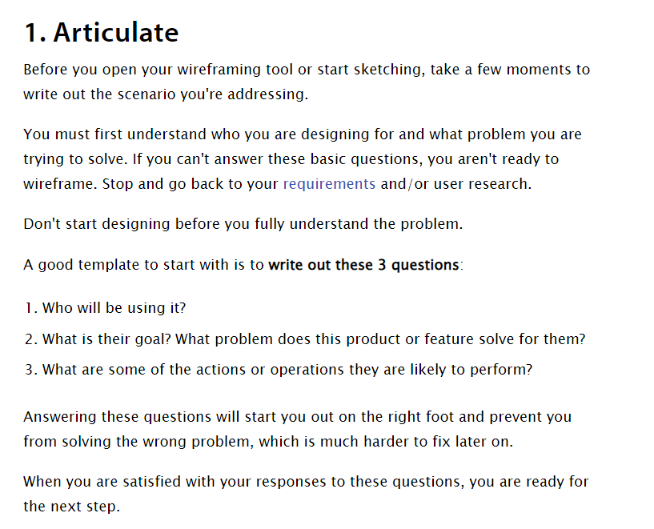

- The developer learned how to use Wirefames from [this Youtube video](https://www.youtube.com/watch?v=9Pv002d0Kls&list=PLVlyYfbClWxQDCGC-A1FkbGyIxtuIN5IM&index=1)

- All Wireframes created with [Balsamic Wireframes](https://balsamiq.com/)

- Estonia Quiz home page Wireframe:

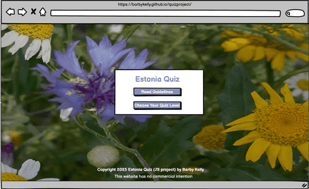


- Guidelines page Wireframe:

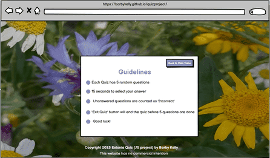
  
- Screenshot of Estonia Quiz test score page, created with Balsamiq Wireframes:


[Back to top](#contents)


## Design

### Images

FAVICON

Developer used an image of a cornflower (Estonian national flower), from her own collection, to create a Favicon.

The original image: 


[Favicon.io](https://favicon.io/favicon-converter/) helped to convert the image into Favicon:


Screenshot of favicon on the website:
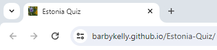


### Color

- As the Estonian national flower is a Cornflower, developer chose 'cornflower blue' as a Background color for the website. Developer found Cornflower blue color code from 
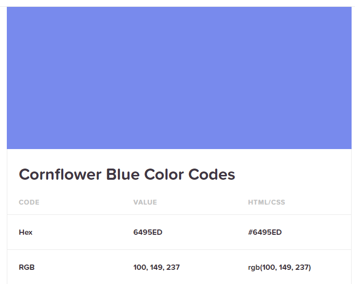

- Color palette from [Mycolor.space](https://mycolor.space/?hex=%236495ED&sub=1)

- Developer checked [Colorhexa.com website]( https://www.colorhexa.com/8090bc) to find a suitable tone color variation for container border


### Font/style

- Developer chose Comfortaa as the main Font style
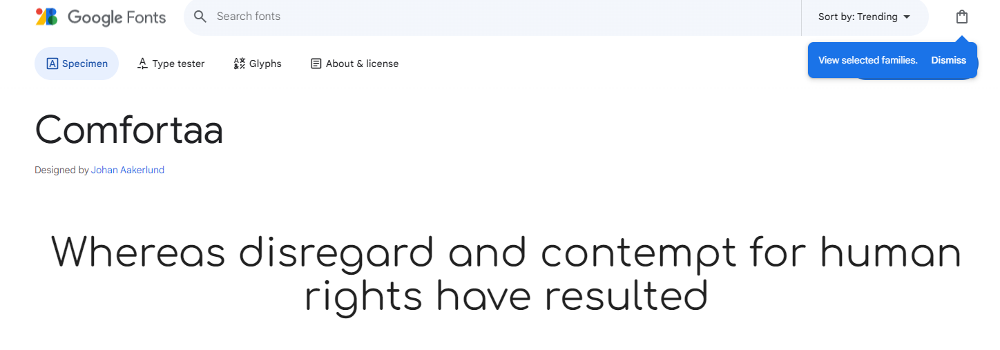 

- Change over to this style? https://fonts.google.com/?preview.text=Estonia%20Quiz&query=cr

from https://fonts.google.com/specimen/Crimson+Text?preview.text=Estonia%20Quiz&query=cr

[Back to top](#contents)

## Features

### Existing Features

#### Home page:

  

  with:

  - Background image of Estonian national flower, cornflower
  - Header
  - 'Read About Guidelines' button
  - 'Choose Your Quiz Level' button
  - Footer

#### Favicon icon:

  Visible at all times while Estonia Quiz site is open:

  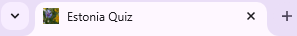

#### Guidelines page:

  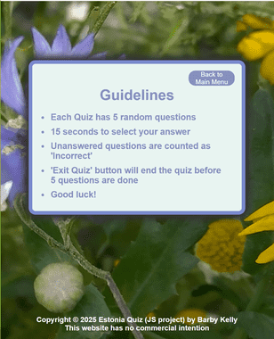

  with:

  - Background image of Estonian national flower, cornflower
  - 'Back to Main Menu' button in top right corner
  - Guidelines heading
  - List of Guidelines for the player


### Future Features

- Player can choose how many questions they want to answer per game
- Increased number of questions
- Add variations of the quiz eg wildlife, culture, music, authors, movies, national symbols and so on
- Add Buttons on top of the page with different languages, for the quiz and for the "Extra" area:
  - English
  - Eesti (Estonian)
- Add "Extra" button to the website, which would bring visitors to an area with links and images to find out more about Estonia 
- Add code to make images pop up when visitor has made their choice. Image of the correct answer (eg picture of lynx)
- Ensure that links open in a new tab, to keep Estonia Quiz page open
- Player can enter a Username before starting Quiz
- Top scores displayed

[Back to top](#contents)


## Languages Used

- JavaScript
- CSS
- HTML

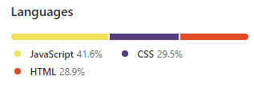


[Back to top](#contents)


## Sites, Apps Used

Developer used these sites/apps to create Estonia Quiz: 

- [Balsamiq Wireframes](https://balsamiq.com/)
- [GitHub](https://github.com/)
- [Gitpod](https://www.gitpod.io/)
- [VS Code](https://code.visualstudio.com/)


[Back to top](#contents)


## Testing

### HTML

- Tested HTML with [Validator.W3](https://validator.w3.org/)

  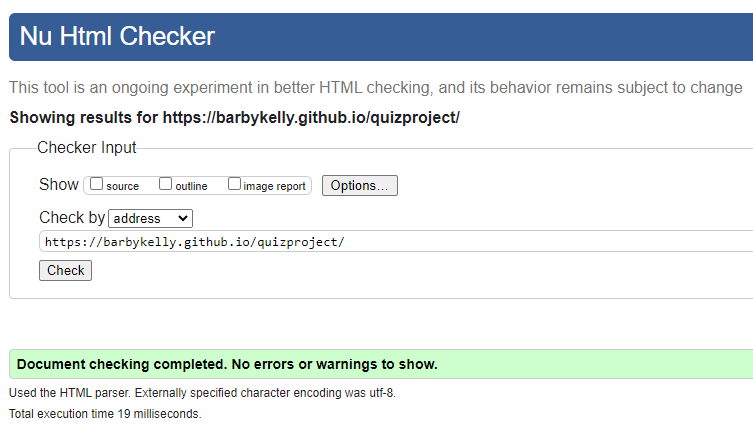

### CSS

- Tested CSS with [Jigsaw W3](https://jigsaw.w3.org/css-validator/validator)

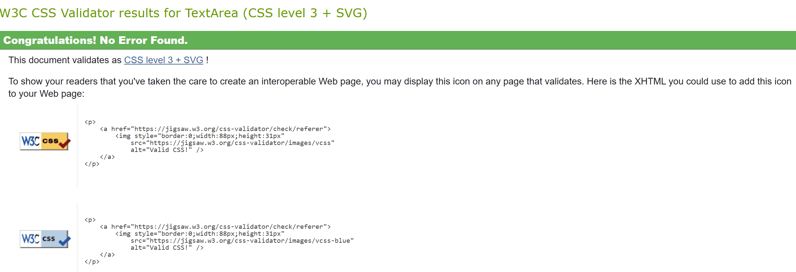

### JS Validation

- Tested JS with 


### Homepage Testing

| Tested Item | Expected Outcome                                                      | Outcome     |
| ----------- | --------------------------------------------------------------------- | ------------|
| Home        | Background image displayed behind the container                       | as expected |
|             | Container is placed in the middle of the screen, all screen sizes     | as expected |
|             | Background-color of the container is #E6F4F1                        | as expected |
|             | Header displayed on top of the container                              | as expected |
|             | 'Read about Guidelines' button displayed below Header                 | as expected |
|             | 'Choose Your Quiz Level' button displayed below 'Read Guidelines' btn | as expected |         
|             | Color of Header and buttons #8090BC                                 | as expected |
|             | Container's background color is #E6F4F1                             | as expected |
|             | Border color of the container is #7189cb                            | as expected |
|             | Shadow effect visible when hovering over buttons                      | as expected |
|             | 'Read about Guidelines' button is clickable, and                      | as expected |
|             | it opens up 'Guidelines'.                                             | as expected |
|             | 'Choose Your Quiz Level' button is clickable,                         | as expected |
|             | and it opens up 'Quiz Levels Menu'.                                   | as expected |
|             |                                                                       |             |
| Footer      | Footer is displayed at the bottom of the page                         | as expected |
|             | Copyright year is up to date                                          | as expected |
|             | Footer color is #FFFFFF                                             | as expected |
|             | Project's name and developer's name are displayed with Copyright      | as expected |
|             | Statement 'This website has no commercial intention' is displayed     | as expected |
|             | Footer is responsive on all screen sizes                              | as expected |  

### 'Read about Guidelines' Menu testing

| Tested Item | Expected Outcome                                                           | Outcome     |
| ----------- | -------------------------------------------------------------------------- | ----------- |
| Guidelines  | 'Guidelines' menu accessed via 'Read about Guidelines' button on Home page | as expected | 
|             | 'Back to Main Menu' button displayed top right                             | as expected |
|             | Guidelines heading displayed middle of the screen                          | as expected |
|             | List of guidelines displayed                                               | as expected |         
|             | Background image displayed behind the conta                                | as expected |
|             | Container is placed in the middle of the screen, for all screen sizes      | as expected |
|             | Click on 'Back to Main Menu' brings user back to Home page                 | as expected |
|             | Color of heading and list items is #8090BC                               | as expected |
|             | Color of 'Back to Main Menu' text is #FFFFFF                             | as expected |
|             | 'Back to Main Menu' background color is #8090BC                          | as expected |         
|             | Container's background color is #E6F4F1                                  | as expected |
|             | Border color of the container is #7189cb                                 | as expected |
|             | 'Back to Main Menu' text is on 2 lines                                     | as expected |


### CSS

Tested CSS with

[Jigsaw.W3](https://jigsaw.w3.org/css-validator/)


### JavaScript

[Site 24X7](https://www.site24x7.com/tools/javascript-validator.html)

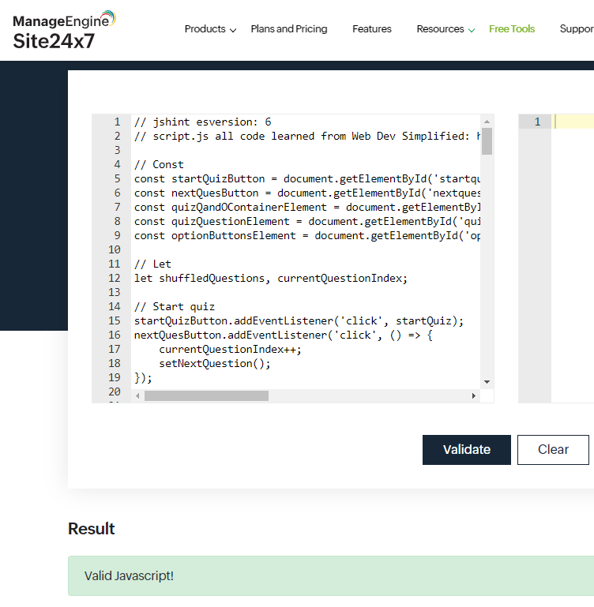


### Lighthouse

Tested with Lighthouse:

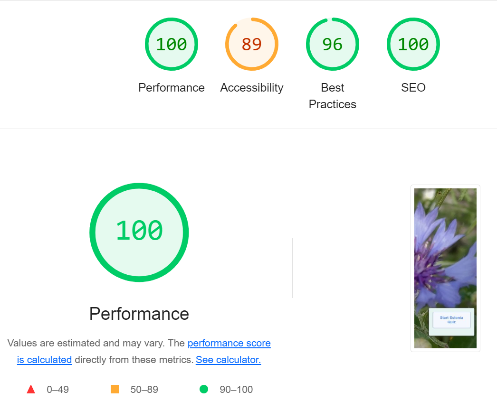

[Back to top](#contents)


## Bug fixing

### Favicon

At first favicon icon did not appear on the website. Developer had used the four line code from
[Favicon.io](https://favicon.io/favicon-converter/)


After comparing Favicon codes vs codes from Love Running, developer noticed that path needed to be adjusted. After adjusting the path, favicon appeared on the website. 


### HTML error

Developer saw the following error when inspecting the website: "Uncaught TypeError: startQuizBtn is not a function at HTMLButtonElement.onclick".

Developer found the solution after reading this [article](https://stackoverflow.com/questions/51282433/typeerror-functionname-is-not-a-function-at-htmlbuttonelement-onclick)

Error had been caused by startQuizBtn, were it was supposed to be startQuizBtnFunction instead.

[Back to top](#contents)


### Color of correct/incorrect answer

When developer tested answer options, and chose the correct or incorrect option, color of the answer options did not change. After checking out [this page](https://www.geeksforgeeks.org/how-to-create-a-simple-javascript-quiz/), the developer noticed that script should be in a different place. Once script was moved into the container, green and red colors showed up for correct/incorrect options, when "Next Question" button was clicked. This testing led to the next bug:

### One of the questions had no correct answer option

Once color showed up correctly for correct vs incorrect answers, developer noticed one of the questions had all options showing up as incorrect. Developer realised that she must have typed 'false' instead of 'true' for all of the options. After setting the correct option as "true", the error remained. Developer cleared the cache, started port again, and then the correct answer turned green.

### Commented out text showing up on deployed version

404 error page displayed commented out parts. Developer realised, she had used CSS commenting style for HTML. Once the comments were corrected as appropriate for HTML,
commented out text no longer appeared on 404 error page.


### Error page styling

- Developer needed to check error pages only on the deployed site, as GitPod would only show the default error page.
  Thanks to mentor Lauren-Nicole Popich, developer knew that error page might not show up properly when testing on GitPod
  
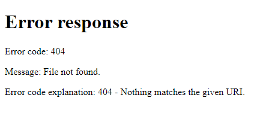

- 404 error page styling was not showing up. Developer edited stylesheet link, which fixed the issue:

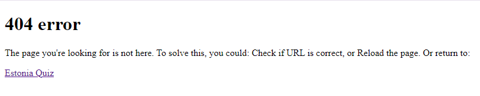

- Background-image for 404 error page was not showing. Developer removed the background-image from error-container styling, which fixed the issue

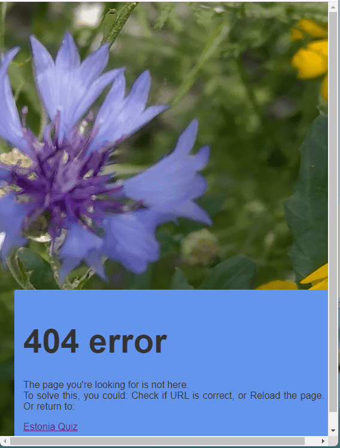

### HTML code lines not showing in README

- Developer noticed that HTML codelines for favicon credit did not show up in README. With tutor Sarah's help, backticks were added, developer
  adjusted the indentation, and the HTML code lines showed up in README

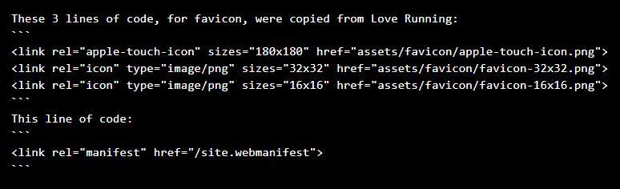

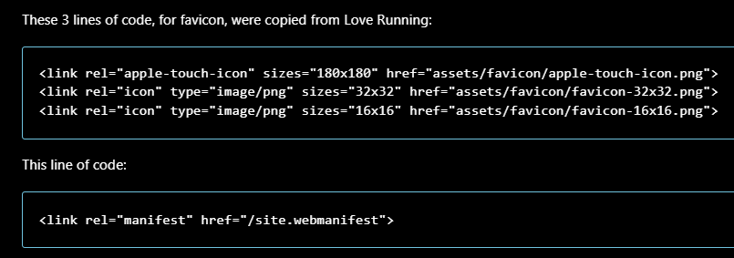

### Button tag error

- When 'Guidelines' and 'Choose Quiz level' buttons were not responsive, developer first checked html validation.

- HTML Validation test showed an error on line 67:

  

- Developer checked index.html, and couldn't see any error on line 67. She then checked Slack, and Google for solution.
  Solution came from [this site](https://rocketvalidator.com/html-validation/start-tag-button-seen-but-an-element-of-the-same-type-was-already-open):

  [Help from Rocket Validator](assets/images/readmeimg/rocket_validator_help.png)

  Developer investigated line 67 again, and noticed that issue was on line 66, as she had deleted '<' jin button's closing tag, by accident, while changing names for quiz levels:

  [HTML line 66 missing >](assets/images/readmeimg/html_tag_error.png)

- Developer added '<' back in front of the closing button, and error was fixed:

  [Fixed button tag](assets/images/readmeimg/button_tag_fixed.png)

- Developer learned from this bug how it's important to look at lines before and after the error, not just the line marked with an error.

#### js version error

- After fixing html error, Developer used [jshint.com](https://jshint.com/) to validate js files. And lots of errors where shown as: "...available in ES6(use     'esversion:6'):

  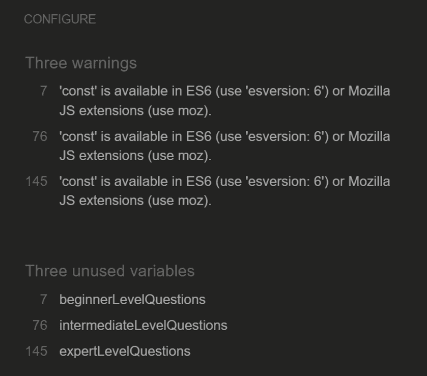

  Developer checked Google, and found a solution on [Stack overflow](https://stackoverflow.com/questions/27441803/why-does-jshint-throw-a-warning-if-i-am-using-const):

  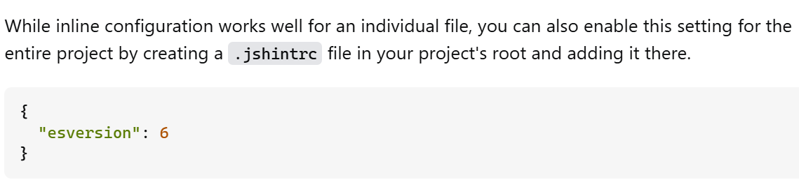

  She swapped previous:

  // jshint esversion: 6 in script.js, 
  
  for

  {
   "esversion: 6"
  }

  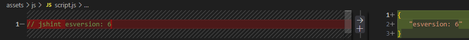

  And she added same to the top of questions.js file. After this, jshint found only couple of issues, no more issues with: "...available in ES6(use 'esversion:6'), but issue with '{' :}

  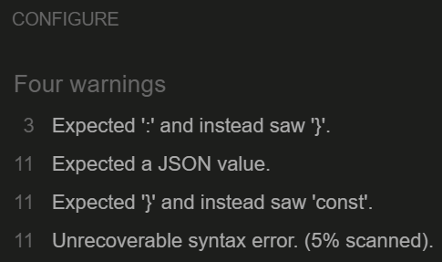

  Developer contacted tutoring, and was given:

  //jshint esversion: 8

  to be used instead. This finally fixed esversion error.

  #### Const and function wording not matching

  - Developer checked id's and classes for Levels, index.html vs script.js, vs questions.js.
  - She noticed that function had 'beginnerQuestions', while in questions.js she had used: 'beginnerLevelQuestions':

  

  - Developer removed 'level' from all three levels in questions.js,
    to match with script.js's wording.

  #### Uncaught Syntax Error: brackets missing

  - Next developer used DevTools to see what was still blocking Guidelines button from working:

  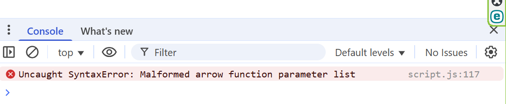

  - She checked line 117 in script.js, and noticed brackets missing:

  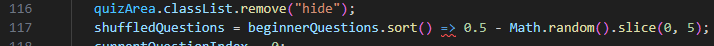

  - Developer fixed line 117 brackets, and also fixed similar issues on lines 126 and 135:

  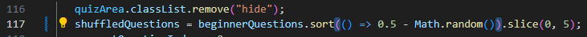

  #### Uncaught SyntaxError: Unexpected token

  - After brackets were fixed, script.js line 289 showed an error:

  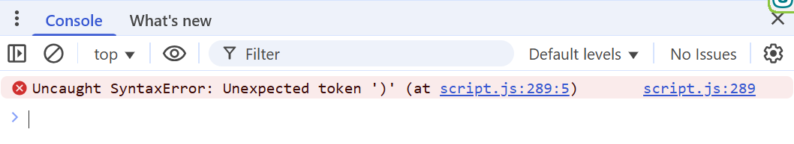

  - While investing where this error was coming from, developer noticed
  that she hadn't swapped 'LevelPrompt' for 'QuizLevelPrompt' on line 35 in script.js,
  while she had swapped it on line 62 in index.html, and on line 10 in script.js.
  Developer corrected the error.

  - Developer deleted ')' from line 289 script.js, to be able to see other errors, as she hadn't located
  the opening '(', to fix that error.

  #### Uncaught TypeError: Cannot read properties of null (reading 'classList')

  - Next, when inspecting the page after clicking on 'Guidelines' button, Uncaught TypeError: Cannot read properties of null (reading 'classList')
    Error showed up for line 46 script.js:

    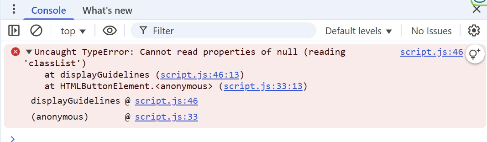

  - Guidelines were now visible, but Main Menu was not hidden as expected:

   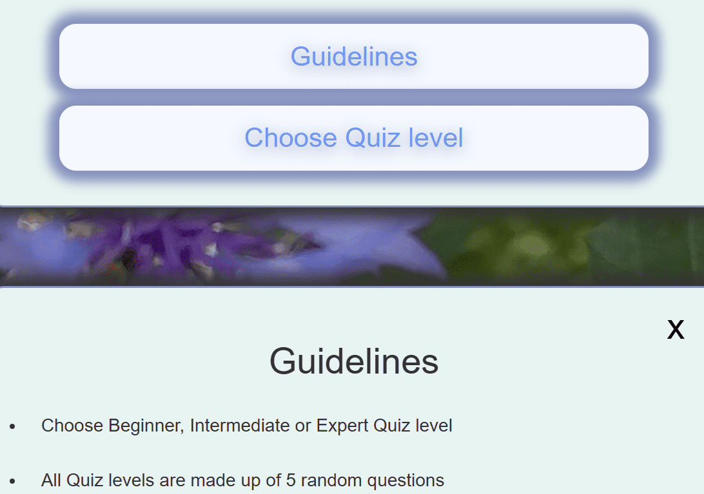

  - Developer checked if all Main menu wording was same in all files, and noticed that she had 
    used camelCase instead of 'id' in const line 8 script.js. Developer fixed the error:

    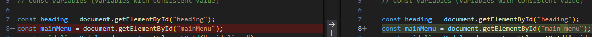

  - Developer tested website again after this fix, and Guidelines opened as expected, 
    while Main Menu became hidden, as expected

### Nothing happened when clicked on 'Choose Your Quiz Level' Button

- Developer inspected the button and script.js error was shown in the console:

  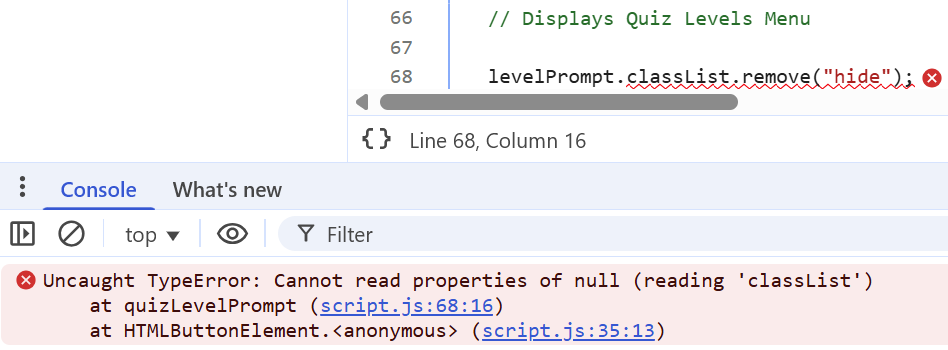

- Developer noticed 'levelPrompt' on line 68 in script.js
- She checked line 10 in script.js:

  const levelPrompt = document.getElementById("quiz_level_prompt");

- And then checked index.html line 54:

  <div id="quiz_level_prompt" class="container hide">

- Developer realised she had updated 'level_prompt' for 'quiz_level_prompt' in script.js line 10,
  but not updated 'id' in index.html.

- Developer updated 'level_prompt' for 'quiz_level_prompt' for the 'id' in index.html line 54.

- This fixed the error, and 'Quiz Levels Menu' opened after clicking on "Choose Your Quiz Level":

  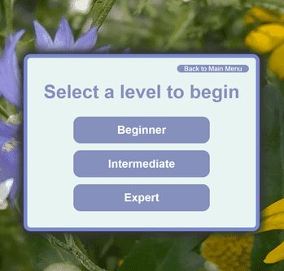


  

## Known Bugs


[Back to top](#contents)


## Creating a GitHub repo:

- Developer clicked on [GitHub link](https://github.com/Code-Institute-Org/ci-full-template) under Love Maths "Getting Set Up" video.

  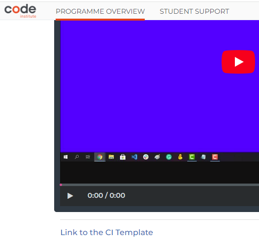


- As the original template was for CodeAnywhere, and developer works with GitPod, developer clicked on [GitPod template](https://github.com/Code-Institute-Org/ci-full-template)

  


- Next the developer clicked on "Use this template", and then clicked on "Create a new repository":

  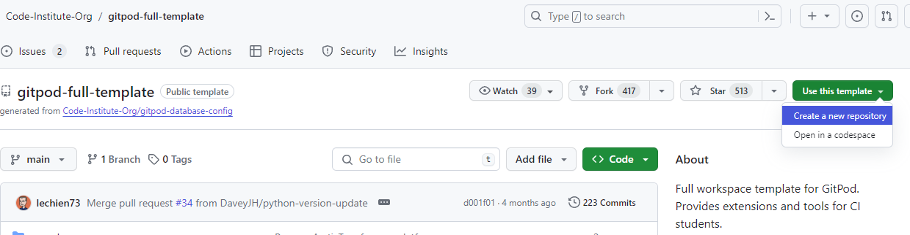


- Developer filled in Repository name, and clicked on "Create repository"

  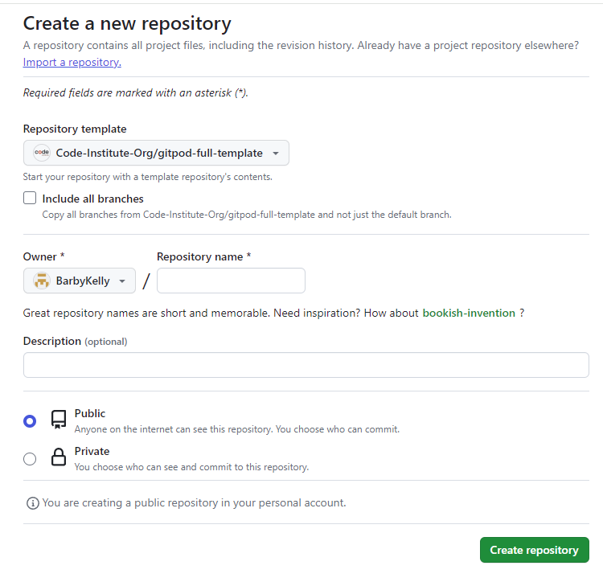


## Deployment

- Click on Github project that you wish to deploy
- Go to Settings (menu at the top)
- Click on Pages (left side menu, under Code and automation)
- Under Build and deployment:
  - Click on "Deploy from a branch"
  - From the drop down menu under Branch, choose "main"
  - After choosing "main", a "/root" folder becomes visible beside it. Leave the root folder as it is
  - Click on "Save"
- GitHub Pages link on top of the "GitHub Pages", will be replaced with your live link

[Back to top](#contents)


## Credits

### Favicon 

- Favicon created using [favicon converter](https://favicon.io/favicon-converter/)

- These 3 lines of code, for favicon, were copied from [Code Institute's 'Love Running' Walk-Through](https://github.com/Code-Institute-Solutions/Love-Running-Solutions)
- ```
  <link rel="apple-touch-icon" sizes="180x180" href="assets/favicon/apple-touch-icon.png">
  <link rel="icon" type="image/png" sizes="32x32" href="assets/favicon/favicon-32x32.png">
  <link rel="icon" type="image/png" sizes="16x16" href="assets/favicon/favicon-16x16.png">
  ```

- This line of code:
  ```
  <link rel="manifest" href="/site.webmanifest"> 
  ```

  for Favicon, was copied from
  https://favicon.io/favicon-converter/

  and with tutor's guidance, developer adjusted 'webmanifest' line to suit her project:

  <link rel="manifest" href="/assets/favicons/site.webmanifest" crossorigin="anonymous">


### README

- Parts of the README template used from [Code Institute's Sample README](https://github.com/Code-Institute-Solutions/SampleREADME?tab=readme-ov-file) 

- Contents menu learned from: [Everything Quiz](https://github.com/Tony118g/the-everything-quiz/blob/main/README.md) 

- Reading The Everything Quiz's README, highlighted for the developer level of details that Quiz website README needs, and demonstrated the value of README. 


### Code

- At the start Developer followed code for Estonia quiz from [Build A Quiz App With JavaScript](https://youtu.be/riDzcEQbX6k?feature=shared). Most of the code for this project is credit to Web Dev Simplified's quiz.

- Code for the Final version of Estonia Quiz, learned from: [The Everything Quiz](https://tony118g.github.io/the-everything-quiz/).
  Developer found the layout and functionality of The Everything Quiz, more suitable for  Estonia Quiz.

- Developer learned more about Media Queries and followed the styling for Media Queries from [this YouTube video](https://www.youtube.com/watch?v=K24lUqcT0Ms*/)

- Footer:

  Developer learned how to make Copyright sign &copy; from [Mental-Arithmetic-Quiz project](https://github.com/Shida18719/Mental-Arithmetic-Quiz/blob/main/index.html)


### Questions

- All of the questions created by the developer, from her own experience, her own knowledge or researching updated information eg population details. 

- Below are some of the websites/images that developer used to validate the answers for the Estonia quiz:

- Northern Europe, screenshot from [gisgeography.com](https://gisgeography.com/europe-map/)


- The developer found this Story about colors of Estonian flag some time ago, unfortunately the link to this article's origin has gone missing.
  Developer did not take this photo, it's visible on the screenshot who took  the photo. Developer did not write this story about the flag. Developer
  is continuing search to find the origin of this flag story. The previous link no longer seems to be available

  


- [eesti.ee](https://www.eesti.ee/en/republic-of-estonia/republic-of-estonia/state-insignia)


- Estonian national bird: 

  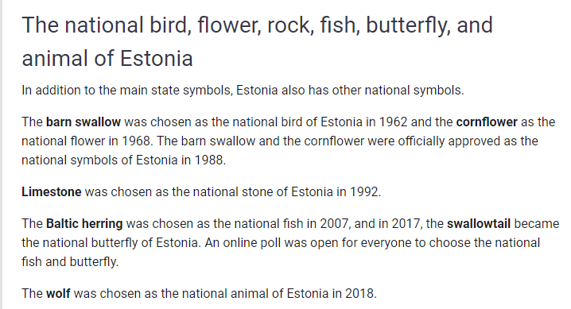


- [Lynx watching tour](https://www.visitestonia.com/en/lynx-and-bear-watching-tour-in-alutaguse-and-lahemaa-national-park?gad_source=5&gclid=EAIaIQobChMI5f2Whpa_gwMVhJhQBh28dgSrEAAYASAAEgIPl_D_BwE)


- Population statistics from [stat.ee](https://www.stat.ee/en/find-statistics/statistics-theme/population)


- Due to covid, the Estonian Song and Dance festival is after 4 years this time:

  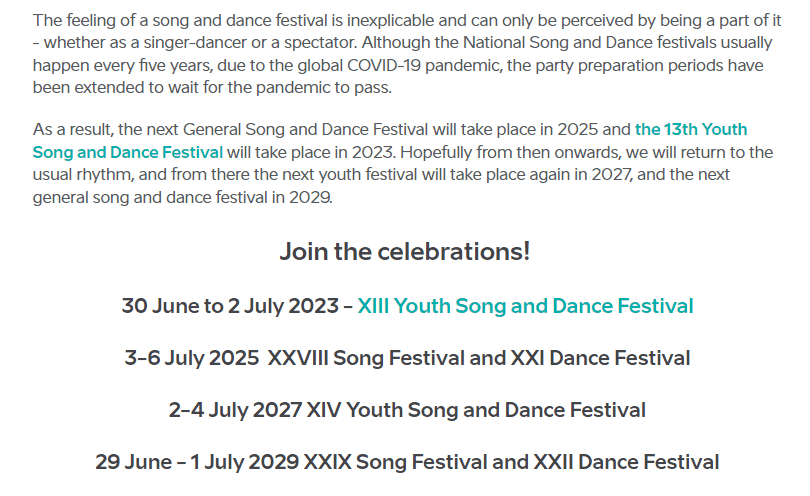 


  Usually every 5 years [the Estonian Song and Dance Festival](https://www.visitestonia.com/en/why-estonia/welcome-to-the-estonian-song-and-dance-celebration)

- To hear numbers in Estonian, visitor can watch this [Youtube video](https://youtube.com/shorts/y2RQWWda-Nc?feature=shared)


### Images 

- Website's background image, with cornflower, taken by the developer. For developer usin image with a Cornflower was meaningful, as it's Quiz about Estonia,
  and Cornflower is Estonia-n national flower.

- Same background image used to create a favicon image, using [favicon converter](https://favicon.io/favicon-converter/)

#### Resized Images

- Developer used [Simple image resizer](https://www.simpleimageresizer.com/resize-image-to-50-kb) to reduce README images
- Developer marked all resized images with 'opt_50'

[Back to top](#contents)


### Error pages

- Developer created Error pages by following code from [this article](https://www.geeksforgeeks.org/create-a-404-page-using-html-and-css/)

- Developer learned from [this site](https://www.presslabs.com/how-to/error-pages/) how site visitors may help themselves with error pages, and added these tips to html


## Acknowledgements

- Code for the Final version of Estonia Quiz, learned from: [The Everything Quiz](https://tony118g.github.io/the-everything-quiz/) . Developer liked the layout and functionality of The Everything Quiz.

- Grateful to my Mentor Lauren-Nicole Popich for supporting me with my project, for listening, for sharing examples like the Leeds Quiz,
  for guiding me to improve my project, and for suggesting to convert the links into  clickable text, among other suggestions.

- Grateful to Coding Group member Patrick Hladun for guiding developer via Slack, to get console errors to show up,
  and how to track errors one by one. He also pointed out where names of the functions were clashing, and some ; vs : errors in developer's code.

- Thank you to Laura Mayock, group's Cohort Facilitator, for our weekly group meetings and guidance, encouraging students to show and talk about their projects.
  And to everyone who took part of the group meetings, shared their projects, and everyone who supported via Slack.

- On the 31st of January 2024, while testing Estonia Quiz in a different browser (Microsoft Edge), and placing developer's own GitHub Estonia Quiz link into search bar,
  the developer came across [Estonian quizzes] (https://www.visitestonia.com/en/why-estonia/play-quizzes-and-test-your-knowledge-about-estonia#). The developer was previously not aware of this Estonian quizzes page, even though she had seen other parts of www.visitestonia.com website, and she had previously credited the main page in README. The developer understands for the future that it is important to Google first, to see if there are similar named projects.

[Back to top](#contents)