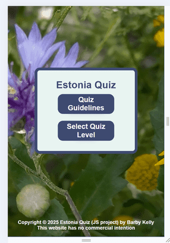
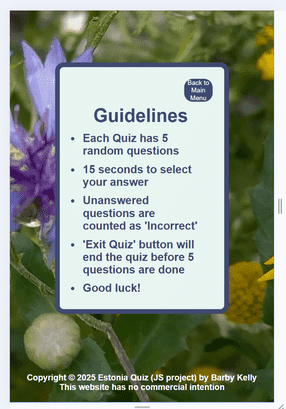
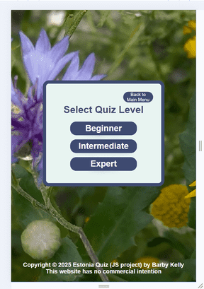
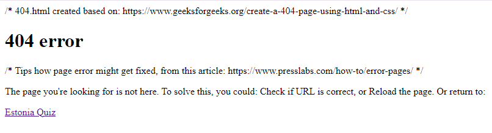
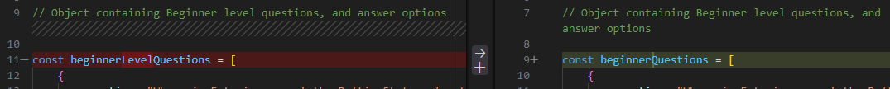

# Estonia Quiz 

Estonia quiz has been created by a Software Development student, as part of Code Institute's Javascript project.
This quiz is suitable for anyone who:
- would like to test their knowledge about Estonia
- likes to do quizzes
- wishes to learn something (new) about Estonia

Link to the live GitHub site: [Estonia Quiz](https://barbykelly.github.io/quizproject/)

Image of the Estonia Quiz site, created with [Am I Responsive?](https://ui.dev/amiresponsive?url=https://barbykelly.github.io/quizproject/),
to show how website looks on different screen sizes:


# Contents

[User Experience](#user-experience)
  - [First Time User](#first-time-user)
  - [Returning User](#returning-user)


[Wireframes](#wireframes)

[Design](#design)
  - [Images](#images)
  - [Color](#color)
  - [Font/Style](#fontstyle)

[Features](#features)

  - [Existing Features](#existing-features)

  - [Future Features](#future-features)
  
[Languages Used](#languages-used)

[Sites, Apps Used](#sites-apps-used)

[Testing and Validation](#testing-and-validation)

  - [Lighthouse Testing](#lighthouse-testing)

  - [HTML Validation](#html-validation)

  - [JS Validation](#js-validation)

  - [Homepage Testing](#homepage-testing)

  - [Quiz Guidelines button Testing](#quiz-guidelines-button-testing)

  - ['Guidelines' Page Testing](#guidelines-page-testing)

  - ['Select Quiz Level' button Testing](#select-quiz-level-button-testing)

  - ['Select Quiz Level' Page Testing](#select-quiz-level-page-testing)

  - ['Beginner Level Quiz' Testing](#beginner-level-quiz-testing)

  - ['Intermediate Level Quiz' Testing](#intermediate-level-quiz-testing)

  - ['Expert Level Quiz' Testing](#expert-level-quiz-testing)

  - ['Exit Quiz' button Testing](#exit-quiz-button-testing)

  - ['End of Quiz' and 'Final Score' Page Testing](#end-of-quiz-and-final-score-page-testing)

  - [Error Page 404 Testing](#error-page-404-testing)

  - [Error Page 500 Testing](#error-page-500-testing)

[Fixed Bugs](#fixed-bugs)

[Known Bugs](#known-bugs)

[Creating a Github Repo](#creating-a-github-repo)

[Deployment](#deployment)

[Credits](#credits)
  - [Code](#code)
  - [Questions](#questions)
  - [Images](#images)

[Acknowledgements](#acknowledgements)

** Developer used 'click/clickable' throughout this project, instead of 'click/tap', for readability

# User Experience

## First Time User:

First time user, may:

- Want to check their knowledge about Estonia
- Learn something new about Estonia
- Click on 'Quiz Guidelines' button
- Read Guidelines on 'Guidelines' page
- Click on 'Back to Main Menu' button to return to Main menu from 'Guidelines' page

- Click on 'Select Quiz Level' button
- Choose Level for the Quiz
- Click on 'Beginner', 'Intermediate' or 'Expert' Level button

- Test that all buttons work on the website
- See one question at a time displayed on the screen
- Click on any of the answers
- Find out which answer was correct when the correct answer turns green, and incorrect answers turn red
- Click on the button: 'Next Question'
- Go through all of the 5 questions
- Exit quiz via "Exit Quiz" button any time during the quiz, except when pop up with Time up is displayed 

[Back to top](#contents)

## Returning User:

Returning user may want to:

- Do all that First Time User may do, as well as:
  - Test their knowledge again
  - Choose a different Quiz Level
  - Improve their score

[Back to top](#contents)


# Website Structure

## Wireframes

- Ideas, how to articulate user's goals, written down after reading this [article](https://balsamiq.com/learn/articles/five-steps-to-great-wireframes/)

  

- The developer learned how to use Wirefames from [this Youtube video](https://www.youtube.com/watch?v=9Pv002d0Kls&list=PLVlyYfbClWxQDCGC-A1FkbGyIxtuIN5IM&index=1)

- All Wireframes created with [Balsamic Wireframes](https://balsamiq.com/)

- Estonia Quiz, Home Page Wireframe:

  

[Back to top](#contents)

- Estonia Quiz, Guidelines page Wireframe:

  
  
- Estonia Quiz, Levels page Wireframe:

  

- Estonia Quiz, Question and answer options displayed, Wireframe:

  

- Estonia Quiz, Next Question Button visible, Wireframe:

  

- Estonia Quiz, Finished, Wireframe:

  


[Back to top](#contents)


# Design

## Images

FAVICON

- Developer used an image of a cornflower (Estonian national flower), from her own collection, to create a Favicon.

- The original image: 

  


  [Favicon.io](https://favicon.io/favicon-converter/) helped to convert the image into Favicon:


- Screenshot of favicon on the website:

  

[Back to top](#contents)

## Color

- As the Estonian national flower is a Cornflower, developer chose 'cornflower blue' as a Background color
  for the website. Developer found Cornflower blue color code from:

  

- Color palette from [Mycolor.space](https://mycolor.space/?hex=%236495ED&sub=1)

- Developer checked [Colorhexa.com website]( https://www.colorhexa.com/8090bc) to find a suitable tone color variation for container border

- Developer looked for a darker color to support #7189cb, and found #405eaf from [colorhexa.com](https://www.colorhexa.com/7189cb)

[Back to top](#contents)

## Font/style

- Developer chose Comfortaa as the main Font style

   

[Back to top](#contents)

# Features

## Existing Features

### Home page:

  

  with:

  - Background image of Estonian national flower, cornflower
  - Container including: 
    - Header
    - 'Quiz Guidelines' button
    - 'Select Quiz Level' button
  - Footer

[Back to top](#contents)

### Favicon icon:

  Visible at all times on the tab, while Estonia Quiz site is open:

  

[Back to top](#contents)

### Guidelines page:

  

  - Background image of Estonian national flower, cornflower
  - Container including:
    - 'Back to Main Menu' button in top right corner
    - Guidelines heading
    - List of Guidelines for the player

[Back to top](#contents)

### Select Quiz Level page:

  

  - Background image of Estonian national flower, cornflower
  - Container including:
    - 'Back to Main Menu' button in top right corner
    - Heading: 'Select a level to begin'
    - Buttons to access different levels of quiz:
        - Beginner
        - Intermediate
        - Expert

[Back to top](#contents)

### Question page:

  - Beginner, Intermediate and Expert Level Quiz Pages look similar in style,
    displaying different selection of questions than other Levels.

  

  - Background image of Estonian national flower, cornflower
  - Container including:

    - Clickable "Exit Quiz" button top right corner
    - Question count x/5
    - Timer (counting down from 15 seconds). More details below: [Timer](#timer)
    - Question (randomly chosen by js, and difficulty depending on player's Quiz Level selection)

    - Three possible answers
    - All answer options displayed in same neutral color #8090BC,
      without indicating which answer is correct, or which answers are incorrect
    - Each question has only one correct answer
    - Two answers are incorrect for each question
    - Five different questions are displayed for any quiz level

    - Player can click on any of the answer buttons
    - Correct answer will turn green when player clicks on the correct answer,
      and both incorrect answers turn red
    - When player chooses incorrect answer:
      - player's chosen answer will turn red,
      - correct answer will turn green, and
      - the other incorrect answer will turn red
    - When one of the answers is selected, then "Next" button is displayed below Answer options, inside the container
    - Player can click on "Next" for the Next Question when present question has been answered or "OK" has been clicked if Time ran out

    - Player can click on "Exit Quiz":
      - After starting the quiz
      - Before answering the question
      - After answering the question

    - Score:

      - 'Score: x' is displayed below answers
      - Score goes up by 1 for each correct answer
    
    ##### Timer:

    - "Next" button is not displayed while Timer is running
    - Timer stops when one of the answer options is chosen, or when Time is up

    - When Timer is up, and no answer was selected:
      - Timer stops
      - 'Timer: 0' is displayed
      - Pop up appears: "barbykelly.github.io says 'Time is up!'", with "OK" button to click on, to close the pop-up:

        

      - 'Question x/5' is displayed on the left of the Timer
      - Question and answer options are displayed

      - Until "OK" is clicked/tapped:
        - All of the answer options for the question remain neutral, 
        - "Exit Quiz" button is displayed, yet it isn't available for clicking/tapping
        - None of the answer options can be selected
        - "Next" button isn't available
        - Score remains as from previous question
        (Developer tested for 15 minutes. Screen remained the same, if "OK" button wasn't clicked)

      - When "OK" button clicked/tapped:
        - Correct answer turned green
        - Incorrect answers remained neutral

[Back to top](#contents)

## Future Features

- Player can choose how many questions they want to answer per game
- Increased number of questions
- Variations of the quiz eg wildlife, culture, music, authors, movies, national symbols and so on
- Buttons on top of the page to change language:
  - English
  - Eesti (Estonian)
  etc.
- "Extra" button added to the website, which would bring visitors to a section with links and images to find out more about Estonia 
- Images popping up when visitor has made their choice. Image of the correct answer (eg picture of lynx)
- Ensure that links open in a new tab, to keep Estonia Quiz page open
- Player can enter a Username before starting Quiz
- Top scores displayed
- Different scores for different Quiz Levels
- Option to listen to the question and answers
- Players can choose different lengths of Time to play the quiz
- Different Time limits for different levels of quizzes
- Player can fill in suggestion box, what kind of questions could be added to quiz, 
  and players can be created beside their suggested questions
  (Developer would confirm validity and relevance of the questions and answers before they are made public)

[Back to top](#contents)


# Languages Used

- HTML
- CSS
- JavaScript


[Back to top](#contents)


# Sites, Apps Used

Developer used these sites/apps to create Estonia Quiz: 

- [GitHub](https://github.com/)
- [Gitpod](https://www.gitpod.io/)
- [VS Code](https://code.visualstudio.com/)
- [Balsamiq Wireframes](https://balsamiq.com/)


[Back to top](#contents)


# Testing and Validation

## Lighthouse Testing

- Tested with Google Dev Tools, Lighthouse:

  

[Back to top](#contents)

[Back to Testing and Validation](#testing-and-validation)

## HTML Validation

- Tested HTML with [Validator.W3](https://validator.w3.org/)

  

[Back to top](#contents)

[Back to Testing and Validation](#testing-and-validation)

## CSS Validation

- Tested CSS with [Jigsaw W3](https://jigsaw.w3.org/css-validator/validator)

  

- To fix the errors, developer:
 - Removed */ from line 265
 - Deleted from line 319:
    .btn {
        padding: auto;
    }

- CSS Validation after fixing errors:

  

[Back to top](#contents)

[Back to Testing and Validation](#testing-and-validation)

## JS Validation

- Tested JS with [Site 24x7](https://www.site24x7.com/tools/javascript-validator.html)

  

[Back to top](#contents)

[Back to Testing and Validation](#testing-and-validation)


## Homepage Testing

| Tested Item | Expected Outcome                                                      | Outcome     |
| ----------- | --------------------------------------------------------------------- | ------------|
| Home        | Background image displayed behind the container                       | as expected |
|             | Container is placed mainly closer to top of the screen                | as expected |
|             | Background-color of the container is #E6F4F1                        | as expected |
|             | Header displayed on top of the container                              | as expected |
|             | 'Quiz Guidelines' button displayed below Header                       | as expected |
|             | 'Select Quiz Level' button displayed below 'Read Guidelines' btn      | as expected |         
|             | Color of Header and buttons #8090BC                                 | as expected |
|             | Container's background color is #E6F4F1                             | as expected |
|             | Border color of the container is #7189cb                            | as expected |
|             | Shadow effect visible when hovering over buttons                      | as expected |
|             | 'Quiz Guidelines' button is clickable, and                            | as expected |
|             | it opens up 'Guidelines'.                                             | as expected |
|             | 'Select Quiz Level' button is clickable,                              | as expected |
|             | and it opens up 'Quiz Levels Menu'.                                   | as expected |
|             |                                                                       |             |
| Footer      | Footer is displayed at the bottom of the page                         | as expected |
|             | Copyright year is up to date                                          | as expected |
|             | Footer color is #FFFFFF                                             | as expected |
|             | Project's name and developer's name are displayed with Copyright      | as expected |
|             | Statement 'This website has no commercial intention' is displayed     | as expected |
|             | Footer is responsive on all screen sizes                              | as expected |

** Developer reported Footer testing only under Homepage testing, as footer style remained similar on all pages

[Back to top](#contents)

[Back to Testing and Validation](#testing-and-validation)


## 'Quiz Guidelines' button testing

| Tested Item            | Expected Outcome                                                     | Outcome     |
| ---------------------- | -------------------------------------------------------------------- | ----------- |
| Quiz Guidelines Button | Button is clickable                                                  | as expected |
|                        | Color of the botton is #8090BC                                     | as expected |
|                        | Text-color is #FFFFFF                                              | as expected |
|                        | Button is inside the container                                       | as expected |
|                        | 'Quiz Guidelines' button is displayed below 'Estonia Quiz', and      | as expected |
|                        | above 'Select Quiz Level' button                                     | as expected |
|                        |                                                                      |             |
|                        | Clicking on 'Quiz Guidelines' button opens up 'Guidelines' page, and | as expected |
|                        | Main Menu is no longer displayed, and                                | as expected |
|                        | 'Back to Main Menu' button becomes available                         | as expected |

[Back to top](#contents)

[Back to Testing and Validation](#testing-and-validation)

## 'Guidelines' Page testing

| Tested Item       | Expected Outcome                                                      | Outcome     |
| ----------------- | --------------------------------------------------------------------- | ------------|
| CSS               | Background image is displayed behind the container                    | as expected |
|                   | Container is usually placed closer to top of the screen               | as expected |
|                   | Guidelines heading and list are displayed inside the container        | as expected |
|                   | 'Guidelines' heading is centered above guidelines                     | as expected |
|                   | List of guidelines displayed                                          | as expected |
|                   | Color of heading and list items is #8090BC                          | as expected |
|                   | Container's background color is #E6F4F1                             | as expected |
|                   | Border color of the container is #7189cb                            | as expected |
|                   |                                                                       |             |
| Back to Main Menu | Button is displayed top right corner inside the container             | as expected |
| Button            | Text Color is #FFFFFF                                               | as expected |
|                   | Background color is #8090BC                                         | as expected |
|                   | Button text is displayed on 2 lines                                   | as expected |
|                   | Clicking on 'Back to Main Menu' brings user back to Home page, and    | as expected |
|                   | closes 'Guidelines'                                                   | as expected |


[Back to top](#contents)

[Back to Testing and Validation](#testing-and-validation)


## 'Select Quiz Level' button testing

| Tested Item                | Expected Outcome                                                    | Outcome     |
| -------------------------- | ------------------------------------------------------------------- | ----------- |
| 'Select Quiz Level' Button | Button is clickable                                                 | as expected |
|                            | Color of the botton is #8090BC                                    | as expected |
|                            | Text-color is #FFFFFF                                             | as expected |
|                            | Button is inside the container                                      | as expected |
|                            | 'Select Quiz Level' button is displayed below 'Estonia Quiz', and   | as expected |
|                            | below 'Quiz Guidelines' button                                      | as expected |
|                            |                                                                     |             |
|                            | Clicking on the button opens up 'Select a level to begin' page, and | as expected |
|                            | Main Menu is no longer displayed, and                               | as expected |
|                            | 'Back to Main Menu' button becomes available                        | as expected |

[Back to top](#contents)

[Back to Testing and Validation](#testing-and-validation)


## 'Select Quiz Level' Page testing

| Tested Item       | Expected Outcome                                                                | Outcome     |
| ----------------- | ------------------------------------------------------------------------------- | ----------- |
| Access            | Accessed via 'Select Quiz Level' button on Home page                            | as expected |
|                   |                                                                                 |             |
| Styling           | Background image displayed behind the container                                 | as expected |
|                   | Color of the heading and quiz levels                                            | as expected |
|                   | Container is usually placed closer to top of the screen                         | as expected |
|                   | Container's background color                                                    | as expected |
|                   | Border color of the container                                                   | as expected |
|                   | 'Select Quiz Level' heading is displayed top centre of the container            | as expected |
|                   | Buttons for Beginner, Intermediate and Expert Quiz Levels are displayed         | as expected |
|                   | Levels are displayed in a column                                                | as expected |
|                   |                                                                                 |             |
| Back to Main Menu | Button is displayed top right corner inside the container                       | as expected |
| Button            | Text Color is #FFFFFF                                                         | as expected |
|                   | Background color is #8090BC                                                   | as expected |
|                   | Button text is displayed on 2 lines                                             | as expected |
|                   | Clicking on 'Back to Main Menu' brings user back to Home page, and              | as expected |
|                   | closes 'Select Quiz Level' page                                                 | as expected |
|                   |                                                                                 |             |
| Beginner Quiz     | 'Beginner' button is clickable                                                  | as expected |
|                   | Clicking on 'Beginner' button starts 'Beginner' Level Quiz                      | as expected |
| Intermediate Quiz | 'Intermediate' button is clickable                                              | as expected |
|                   | Clicking on 'Intermediate' button starts 'Intermediate' Level Quiz              | as expected |
| Expert Quiz       | 'Expert' button is clickable                                                    | as expected |
|                   | Clicking on 'Expert' button starts 'Expert' Level Quiz                          | as expected |

[Back to top](#contents)

[Back to Testing and Validation](#testing-and-validation)

## Testing of Quiz Levels

### 'Beginner Level Quiz' testing

| Tested Item       | Expected Outcome                                                                | Outcome     |
| ----------------- | ------------------------------------------------------------------------------- | ----------- |
| Beginner          | Each Question is randomly chosen                                                | as expected |  
|                   | Question number is displayed x/5                                                | as expected |
|                   | Question number increases by 1 for each next question                           | as expected |
|                   | Timer is displayed, and starts to countdown towards zero                        | as expected |         
|                   | Question is displayed below 'Question nr' and Timer                             | as expected |
|                   | Three Answer buttons are displayed below the Question                           | as expected |
|                   | All of the Answer buttons are same color #8090BC                              | as expected |
|                   | 'Score: 0' is displayed below Answer buttons at the start of the quiz           | as expected |
|                   | All Answer buttons are clickable                                                | as expected |
|                   | Player can choose which answer button to choose                                 | as expected |
|                   | When correct answer is chosen, only that Answer button turns green              | as expected |
|                   | If incorrect answer is chosen, correct Answer turns green, and                  | as expected |
|                   | chosen incorrect answer turns red, and                                          | as expected |
|                   | the second incorrect answer turns red too.                                      | as expected |
|                   | Each Quiz has 5 Questions                                                       | as expected |
|                   | Next button is displayed when correct answer has turned green                   | as expected |
|                   | Player can only use Next button after correct answer is displayed as green      | as expected |
|                   | Quiz ends after 5 Questions, or                                                 | as expected |
|                   | When "Exit Quiz" button is clicked                                              | as expected |

[Back to top](#contents)

[Back to Testing and Validation](#testing-and-validation)

### 'Intermediate Level Quiz' testing

| Tested Item       | Expected Outcome                                                                | Outcome     |
| ----------------- | ------------------------------------------------------------------------------- | ----------- |
| Intermediate      | 'Intermediate Level Quiz' questions are different to other Levels               | as expected |
|                   |                                                                                 |             |
|                   | ** Rest of the 'Intermediate Level Quiz' testing results identical to           |             |
|                   | [Beginner Quiz Testing](#beginner-level-quiz-testing) results                   | as expected |

[Back to top](#contents)

[Back to Testing and Validation](#testing-and-validation)

### 'Expert Level Quiz' testing

| Tested Item       | Expected Outcome                                                                | Outcome     |
| ----------------- | ------------------------------------------------------------------------------- | ----------- |
| Expert            | Questions for 'Expert Level Quiz' are different to other levels                 | as expected |
|                   |                                                                                 |             |
|                   | ** Rest of the 'Expert Level Quiz' testing results same as                      |             |
|                   | [Beginner Quiz Testing](#beginner-level-quiz-testing) results                   | as expected |

[Back to top](#contents)

[Back to Testing and Validation](#testing-and-validation)

### 'Exit Quiz' button testing

| Tested Item       | Expected Outcome                                                                | Outcome     |
| ----------------- | ------------------------------------------------------------------------------- | ----------- |
| Exit Quiz Button  | "Exit Quiz" button hidden before Quiz Level is chosen                           | as expected |
|                   | Displayed at the top right corner of the container, when quiz starts            | as expected |
|                   | Color of the button: #8090BC                                                  | as expected |
|                   | Text color #FFFFFF                                                            | as expected |
|                   | When "Exit Quiz" button is clicked/tapped, Home page/Main menu opens            | as expected |           
|                   | Can be clicked when Question is displayed                                       | as expected |
|                   | Button not clickable when pop-up "Time is up" is displayed                      | as expected |
|                   | "Exit Quiz" Button ends the Quiz (unless player answered all 5 questions)       | as expected |
|                   | Can be clicked before answering the Question                                    | as expected |
|                   | Can be clicked when next Question is displayed                                  | as expected |
|                   | Can be clicked before answering the next Question                               | as expected |
|                   | Can be clicked before answering the next Question                               | as expected |
|                   | "Exit Quiz" button hidden when game ends                                        | as expected |
|                   | "Exit Quiz" button hidden when player returns to Home Page/Main Menu            | as expected |

[Back to top](#contents)

[Back to Testing and Validation](#testing-and-validation)

### 'End of Quiz' and 'Final Score' Page Testing


| Tested Item       | Expected Outcome                                                            | Outcome     |
| ----------------- | --------------------------------------------------------------------------- | ----------- |
| End of Quiz! text | At the end of the Quiz, 'End of Quiz!' text is displayed                    | as expected |
|                   | Text is displayed above other items in the container                        | as expected |
|                   | 'End of Quiz!' text is not clickable                                        | as expected |
|                   |                                                                             |             |
| Final Score       | Final Score is displayed below 'End of Quiz!' text                          | as expected |
|                   | 'Final Score' is not clickable                                              | as expected |
|                   | Displayed as 'Final Score x/5' depending on the Score (eg 3/5 if 3 correct) | as expected |
|                   |                                                                             |             |
| Play Again Button | 'Play Again' Button is displayed below 'Final Score x/5'                    | as expected |
|                   | Button is clickable                                                         | as expected |
|                   | Clicking on 'Play Again' brings player back to 'Select Quiz Level' page     | as expected |
|                   |                                                                             |             |
| Main Menu Button  | 'Main Menu' Button is displayed below 'Play Again' Button                   | as expected |
|                   | Button is clickable                                                         | as expected |
|                   | Clicking on 'Main Menu' brings player back to 'Home Page'                   | as expected |

[Back to top](#contents)

[Back to Testing and Validation](#testing-and-validation)

### 'Error Page 404' Testing


| Tested Item    | Expected Outcome                                                 | Outcome     |
| -------------- | ---------------------------------------------------------------- | ------------|
| Error Page 404 | Background image is displayed behind the content                 | as expected |
|                | 404 Error is displayed above rest of the content                 | as expected |
|                | Text is displayed to notify user of incorrect URL                | as expected |
|                | Options, how to fix this error, are displayed                    | as expected |
|                | Link to access 'Estonia Quiz' is displayed                       | as expected |
|                | Link is clickable                                                | as expected |
|                | Link is in a different color than rest of 404 error page content | as expected |
|                | Background color behind the link is displayed                    | as expected |
|                | 'Estonia Quiz' with correct URL opens up after link is clicked   | as expected |

[Back to top](#contents)

[Back to Testing and Validation](#testing-and-validation)

### 'Error Page 500' Testing


| Tested Item    | Expected Outcome                                                 | Outcome     |
| -------------- | ---------------------------------------------------------------- | ------------|
| Error Page 500 | Background image is displayed behind the content                 | as expected |
|                | 500 Error is displayed above rest of the content                 | as expected |
|                | Text is displayed to notify user of 'Internal Server Error'      | as expected |
|                | Options, how to fix this error, are displayed                    | as expected |
|                | Link to access 'Estonia Quiz' is displayed                       | as expected |
|                | Link is clickable                                                | as expected |
|                | Link is in a different color than rest of 500 error page content | as expected |
|                | Background color behind the link is displayed                    | as expected |
|                | 'Estonia Quiz' with correct URL opens up after link is clicked   | as expected |

[Back to top](#contents)

[Back to Testing and Validation](#testing-and-validation)

# Fixed Bugs

## Favicon

- At first favicon icon did not appear on the website. Developer had used the four line code from:

  [Favicon.io](https://favicon.io/favicon-converter/)

  

- After comparing Favicon codes vs codes from Love Running, developer noticed that path needed to be adjusted. After adjusting the path, favicon appeared on the website. 

[Back to top](#contents)

[Back to Testing and Validation](#testing-and-validation)

## HTML error

- Developer saw the following error when inspecting the website: "Uncaught TypeError: startQuizBtn is not a function at HTMLButtonElement.onclick".

- Developer found the solution after reading this [article](https://stackoverflow.com/questions/51282433/typeerror-functionname-is-not-a-function-at-htmlbuttonelement-onclick)

- Error had been caused by startQuizBtn, were it was supposed to be startQuizBtnFunction instead.

[Back to top](#contents)

[Back to Testing and Validation](#testing-and-validation)

## Color of correct/incorrect answer

- When developer tested answers, and chose the correct or incorrect answer, color of the answers did not change.
  After checking out [this page](https://www.geeksforgeeks.org/  how-to-create-a-simple-javascript-quiz/),
  the developer noticed that script should be in a different place. Once script was moved into the container,
  green and red colors showed up for correct/incorrect answers, when "Next Question" button was clicked. This testing led to the next bug: "One of the questions had no correct answer"

[Back to top](#contents)

[Back to Testing and Validation](#testing-and-validation)

## One of the questions had no correct answer

- Once color showed up correctly for correct vs incorrect answers, developer noticed one of the questions had all answers
  showing up as incorrect. Developer realised that she must have typed 'false' instead of   'true' for all of the answers,
  for that question. After setting the correct answer as "true", the error remained.
  Developer cleared the cache, started port again, and then the correct answer turned green.

[Back to top](#contents)

[Back to Testing and Validation](#testing-and-validation)

## Commented out text showing up on deployed version

- 404 error page displayed commented out parts. Developer realised, she had used CSS commenting style for HTML.
  Once the comments were corrected as appropriate for HTML,
  commented out text no longer appeared on 404 error page.

  

[Back to top](#contents)

[Back to Testing and Validation](#testing-and-validation)


## Error page styling

- Developer needed to check error pages only on the deployed site, as GitPod would only show the default error page.
  Thanks to my mentor [Lauren-Nicole Popich](https://github.com/CluelessBiker), developer knew that error page might not show up properly when testing on GitPod
  
  

- 404 error page styling was not showing up. Developer edited stylesheet link, which fixed the issue:

  

- Background-image for 404 error page was not showing. Developer removed the background-image from error-container styling, which fixed the issue

  

[Back to top](#contents)

[Back to Testing and Validation](#testing-and-validation)

## HTML code lines not showing in README

- Developer noticed that HTML code lines for favicon credit did not show up in README. With tutor Sarah's help, backticks were added, developer
  adjusted the indentation, and the HTML code lines showed up in README

  

  

[Back to top](#contents)

[Back to Testing and Validation](#testing-and-validation)

## Button tag error

- When 'Guidelines' and 'Choose Quiz level' buttons were not responsive, developer first checked html validation.

- HTML Validation test showed an error on line 67:

  

- Developer checked index.html, and couldn't see any error on line 67. She then checked Slack, and Google for solution.
  Solution came from [this site](https://rocketvalidator.com/html-validation/start-tag-button-seen-but-an-element-of-the-same-type-was-already-open):

  [Help from Rocket Validator](assets/images/readmeimg/rocket_validator_help.png)

  Developer investigated line 67 again, and noticed that issue was on line 66, as she had deleted '<' jin button's closing tag, by accident, while changing names for quiz levels:

  [HTML line 66 missing >](assets/images/readmeimg/html_tag_error.png)

- Developer added '<' back in front of the closing button, and error was fixed:

  [Fixed button tag](assets/images/readmeimg/button_tag_fixed.png)

- Developer learned from this bug how it's important to look at lines before and after the error, not just the line marked with an error.

[Back to top](#contents)

[Back to Testing and Validation](#testing-and-validation)

### js version error

- After fixing html error, Developer used [jshint.com](https://jshint.com/) to validate js files. And lots of errors where shown as: "...available in ES6(use     'esversion:6'):

  

- Developer checked Google, and found a solution on [Stack overflow](https://stackoverflow.com/questions/27441803/why-does-jshint-throw-a-warning-if-i-am-using-const):

  

- Developer swapped previous:

  ```
  // jshint esversion: 6 in script.js, 
  ```

  for

  ```
  {
   "esversion: 6"
  }
  ```

  

- And she added same to the top of questions.js file. After this, jshint found only couple of issues, no more issues with: "...available in ES6(use 'esversion:6'), but issue with '{' :}

  

- Developer contacted tutoring, and was given:
  
  ```
  //jshint esversion: 8
  ```

  to be used instead. This change fixed esversion error.

[Back to top](#contents)

[Back to Testing and Validation](#testing-and-validation)

## Const and function wording not matching

 - Developer checked id's and classes for Levels, index.html vs script.js, vs questions.js.
 - She noticed that function had 'beginnerQuestions', while in questions.js she had used: 'beginnerLevelQuestions':

   

- Developer removed 'level' from all three levels in questions.js,
  to match with script.js's wording.

[Back to top](#contents)

[Back to Testing and Validation](#testing-and-validation)

## Uncaught Syntax Error: brackets missing

  - Next developer used DevTools to see what was still blocking Guidelines button from working:

    

  - She checked line 117 in script.js, and noticed brackets missing:

    

  - Developer fixed line 117 brackets, and also fixed similar issues on lines 126 and 135:

    

[Back to top](#contents)

[Back to Testing and Validation](#testing-and-validation)

 ## Uncaught SyntaxError: Unexpected token

  - After brackets were fixed, script.js line 289 showed an error:

    

[Back to top](#contents)

[Back to Testing and Validation](#testing-and-validation)


  ## Uncaught TypeError: Cannot read properties of null (reading 'classList')

  - Next, when inspecting the page after clicking on 'Guidelines' button, Uncaught TypeError: Cannot read properties of null (reading 'classList')
    Error showed up for line 46 script.js:

    

  - Guidelines were now visible, but Main Menu was not hidden as expected:

    

  - Developer checked if all Main menu wording was same in all files, and noticed that she had 
    used camelCase instead of 'id' in const line 8 script.js. Developer fixed the error:

    

  - Developer tested website again after this fix, and Guidelines opened as expected, 
    while Main Menu became hidden, as expected

[Back to top](#contents)

[Back to Testing and Validation](#testing-and-validation)

## Nothing happened when clicked on 'Choose Your Quiz Level' Button

- Developer inspected the button and script.js error was shown in the console:

  

- Developer noticed 'levelPrompt' on line 68 in script.js

- She checked line 10 in script.js:

  const levelPrompt = document.getElementById("quiz_level_prompt");

- And then checked index.html line 54:

  <div id="quiz_level_prompt" class="container hide">

- Developer realized she had updated 'level_prompt' for 'quiz_level_prompt' in script.js line 10,
  but not updated 'id' in index.html.

- Developer updated 'level_prompt' for 'quiz_level_prompt' for the 'id' in index.html line 54.

- This fixed the error, and 'Quiz Levels Menu' opened after clicking on "Choose Your Quiz Level":

  

[Back to top](#contents)

[Back to Testing and Validation](#testing-and-validation)

## No container displayed, when clicked on "Main Menu" after quiz ended:

- Only background image and footer visible after clicking on "Main Menu", when quiz ended.

- Developer inspected the page, and noticed:

  <div id="quiz_finish" class="hide container"> in index.html:

  

- Developer checked wording in index.html vs script.js re "main_menu_btn",
  and found an error on line 293 in script.js,
  where she had used "main_menu_button" instead of "main_menu_btn":

  

- Developer fixed the error:

  

- When Developer clicked on "Main Menu" button at the end of the Quiz, button worked as expected, by displaying the Main page

[Back to top](#contents)

[Back to Testing and Validation](#testing-and-validation)

## Footer Blue Background

- When developer tested quiz with Dev Tools for iPhone SE and Samsung Galaxy S8, blue area was shown behind the footer,
  and quiz container was extended, so developer had to scroll down to see the footer:

  

- With other phones eg iPhone XR, Samsung Galaxy S20 Ultra, Quiz and footer were displayed as expected:

  

- Developer couldn't solve the issue with styling footer or body height.

- Tutor [Rebecca](https://github.com/rebeccatraceyt) helped developer to fix it, by suggesting to use min-height instead of height,
  when none of developer's options worked

- Adding 'min' fixed the error:

  
  
- No more blue back-ground color behind footer.

- Background image was now displayed for all screen sizes

[Back to top](#contents)

## Part of the Container and Footer not displayed, without scrolling for certain screen sizes

- When developer clicked to start any quiz, Container became too long for certain screen sizes, and Footer was not visible without scrolling,
  and Container became even longer when "Next" question became unhidden

- Developer compared the height of gadgets which displayed Quiz page as expected:

  

- versus gadgets where Container became too long, when Quiz started, and where footer was not visible, without scrolling:

  

  

- Developer compared screen height of gadgets that displayed quiz as expected (container and footer fitting on the screen),
  vs gadgets with whole Container and footer not fitting on the screen.

- She noticed gadgets with screen height between 600 and 740 (eg iPhone SE, Nest Hub and so on), were the ones where Container became too long when Quiz had started,
  and hidden items were displayed in the Container

- Developer adjusted padding, margins, width, max-width, media queries, body, container, buttons, headings, to get container to fit right for different 
  screen sizes.

- As a result, Container and Footer fitted on all screen sizes, without needing to scroll:

  

## Error, 'undefined' if score: 0

- Developer posted code for #peer-review (Slack channel for Code Institute students), and Matthew J found issues with score zero, 2 different errors:
  'undefined score: 0 error', and 'object HTMLSpanElement' error.

- Developer had not tested quiz with zero score. Grateful to Matthew J for finding and highlighting this bug.

- Developer recreated 'underfined score: 0 error' to inspect it:

  

- She didn't see anything in console to help to solve it

- Developer tested other quizzes, to see how they worked with score: 0.
  Score 0 was displayed nicely in [Leeds Quiz](https://andreas-ka.github.io/leeds-quiz/).
  Developer noticed, that quiz had on line 14 in script.js:

  ```
  let userScore = 0;
  ```

  while line 22 script.js in Estonia Quiz had:

  ```
  let quizScore;
  ```

- Developer added '= 0' to line 22:

  ```
  let quizScore = 0;
  ```

  and this fixed the error:

  

## 'Object HTMLSpanElement' - 2nd error for Zero Score

- Developer was able to recreate 2nd error for Zero Score:

  

- There was no error displayed in console

- On some occasions, when Developer tried to get Zero score for testing, 0/5 score displayed as expected.

- Developer checked index.html line 83:

  ```
  <p>Final Score <span id="final_score">0</span>/5</p>
  ```

- Developer checked Leeds Quiz final score line, with Zero score, to see how that looked in Dev Tools

- Developer tried different versions for line 83 in index.html, to fix the error.

- Tutor Rebecca helped Developer to see js was causing the issue:

  ```
  finalScore.innerText = quizScore;
  ```

- Once this was changed for:

  ```
  finalScore = quizScore;
  ```

- Error didn't occur again during testing,
  and Final Score result looked ok:

  

## Selected incorrect answer turned red, while the other incorrect answer didn't change color (CheckQuizAnswer function)

  - If player chose incorrect answer, that answer turned red, and the other incorrect answer remained neutral color,
    while correct answer turned green:

    

  - Developer preferred to see all incorrect answers turn red when:
    - correct answer was chosen, or
    - incorrect answer was chosen, or
    - no answer chosen before Time was up
  
  - None of Developer's attempts turned both incorrect answers red.
  
  - Tutor Roman Rakic guided Developer how to fix this bug, by adjusting 'CheckQuizAnswer function':

    
  
  - Both incorrect answers turned red after this fix:

    

## Final score is displaying incorrect result

- Developer tested Final Score result, and Final Score was 1/5 or 2/5,
  even when all questions were answered correctly.
- Final Score seemed to count how many times quiz was played (before page was refreshed),
  instead of reflecting Score
- With Tutor Oisin Tohak's help, Developer fixed the error:

  

  and Final Score once again reflected the actual score

[Back to top](#contents)

[Back to Testing and Validation](#testing-and-validation)
  
# Known Bugs

## No clear indication of chosen answer, when correct/incorrect results are displayed

- It would be helpful if player's chosen answer remained different, so player knows that was their chosen answer.
  Once all answers change color, it's hard to tell which one was player's choice.
  Developer understands better now why some other quizzes had only one or two of the answer buttons change color:
  it made more clear if player chose the correct or incorrect answer.

## Only correct answer changes color, when time is up

- When Time is up, and Player didn't choose any answer, correct answer will turn green,
  both incorrect answers remain neutral color

## Container position

- Container is placed closer to top of the screen than the middle of the page.
  

[Back to top](#contents)


# Creating a GitHub repo:

- Developer clicked on [GitHub link](https://github.com/Code-Institute-Org/ci-full-template) under Love Maths "Getting Set Up" video.

  


- As the original template was for CodeAnywhere, and developer works with GitPod, developer clicked on [GitPod template](https://github.com/Code-Institute-Org/ci-full-template)

  


- Next the developer clicked on "Use this template", and then clicked on "Create a new repository":

  


- Developer filled in Repository name, and clicked on "Create repository"

  

[Back to top](#contents)

## Deployment

- Click on Github project that you wish to deploy
- Go to Settings (menu at the top)
- Click on Pages (left side menu, under Code and automation)
- Under Build and deployment:
  - Click on "Deploy from a branch"
  - From the drop down menu under Branch, choose "main"
  - After choosing "main", a "/root" folder becomes visible beside it. Leave the root folder as it is
  - Click on "Save"
- GitHub Pages link on top of the "GitHub Pages", will be replaced with your live link

[Back to top](#contents)


## Credits

### Favicon 

- Favicon created using [favicon converter](https://favicon.io/favicon-converter/)

- These 3 lines of code, for favicon, were copied from [Code Institute's 'Love Running' Walk-Through](https://github.com/Code-Institute-Solutions/Love-Running-Solutions)
- ```
  <link rel="apple-touch-icon" sizes="180x180" href="assets/favicon/apple-touch-icon.png">
  <link rel="icon" type="image/png" sizes="32x32" href="assets/favicon/favicon-32x32.png">
  <link rel="icon" type="image/png" sizes="16x16" href="assets/favicon/favicon-16x16.png">
  ```

- This line of code:
  ```
  <link rel="manifest" href="/site.webmanifest"> 
  ```

  for Favicon, was copied from
  https://favicon.io/favicon-converter/

  and with tutor's guidance, developer adjusted 'webmanifest' line to suit her project:

  <link rel="manifest" href="/assets/favicons/site.webmanifest" crossorigin="anonymous">

[Back to top](#contents)

### README

- Parts of the README template used from [Code Institute's Sample README](https://github.com/Code-Institute-Solutions/SampleREADME?tab=readme-ov-file) 

- Contents menu learned from: [Everything Quiz](https://github.com/Tony118g/the-everything-quiz/blob/main/README.md) 

- Reading The Everything Quiz's README, highlighted for the developer level of details that Quiz website README needs, and demonstrated the value of README. 

[Back to top](#contents)

### Code

- At the start Developer followed code for Estonia quiz from [Build A Quiz App With JavaScript](https://youtu.be/riDzcEQbX6k?feature=shared).
  Then tried to learn quiz code from Web Dev Simplified's quiz.

- Code for the Final version of Estonia Quiz, learned from: [The Everything Quiz](https://tony118g.github.io/the-everything-quiz/).
  Developer found the layout and functionality of The Everything Quiz, suitable for Estonia Quiz

- Developer learned more about Media Queries and followed the styling for Media Queries from [this YouTube video](https://www.youtube.com/watch?v=K24lUqcT0Ms*/)

- Footer:

  Developer learned how to make Copyright sign &copy; from [Mental-Arithmetic-Quiz project](https://github.com/Shida18719/Mental-Arithmetic-Quiz/blob/main/index.html)

[Back to top](#contents)

### Questions

- All of the questions created by the developer, from her own experience, her own knowledge or researching updated information eg population details. 

- Below are some of the websites/images that developer used to validate some of the answers for the Estonia quiz:

- Northern Europe, screenshot from [gisgeography.com](https://gisgeography.com/europe-map/)

  

[Back to top](#contents)

- The developer found this Story about colors of Estonian flag some time ago,
  unfortunately the link to this article's origin has gone missing.
  Developer did not take this photo. It's visible on the screenshot who took the photo.
  Developer did not write this story about the flag. Developer
  is continuing search to find the origin of this flag story. The previous link no longer seems to be available

  

[Back to top](#contents)

- [eesti.ee](https://www.eesti.ee/en/republic-of-estonia/republic-of-estonia/state-insignia)


- Estonian national bird: 

  

[Back to top](#contents)

- [Lynx watching tour](https://www.visitestonia.com/en/lynx-and-bear-watching-tour-in-alutaguse-and-lahemaa-national-park?gad_source=5&gclid=EAIaIQobChMI5f2Whpa_gwMVhJhQBh28dgSrEAAYASAAEgIPl_D_BwE)


- Population statistics from [stat.ee](https://www.stat.ee/en/find-statistics/statistics-theme/population)


- Due to covid, the Estonian Song and Dance festival is after 4 years this time:

   


  Usually every 5 years [the Estonian Song and Dance Festival](https://www.visitestonia.com/en/why-estonia/welcome-to-the-estonian-song-and-dance-celebration)

[Back to top](#contents)

- To hear numbers in Estonian, visitor can watch this [Youtube video](https://youtube.com/shorts/y2RQWWda-Nc?feature=shared)


### Images 

- Website's background image, with cornflower, taken by the developer. For developer usin image with a Cornflower was meaningful, as it's Quiz about Estonia,
  and Cornflower is Estonia-n national flower.

- Same background image used to create a favicon image, using [favicon converter](https://favicon.io/favicon-converter/)

[Back to top](#contents)

#### Resized Images

- Developer used [Simple image resizer](https://www.simpleimageresizer.com/) to reduce README images
- Developer marked all resized images with 'opt_50' or 'opt_100'

[Back to top](#contents)

### Error pages

- Developer created Error pages by following code from [this article](https://www.geeksforgeeks.org/create-a-404-page-using-html-and-css/)

- Developer learned from [presslabs.com](https://www.presslabs.com/how-to/error-pages/) how site visitors may help themselves with error pages, and added these tips to html

[Back to top](#contents)

### Am I Responsive image

- Created with [Am I Responsive]( https://ui.dev/amiresponsive)

[Back to top](#contents)

## Acknowledgements

- Code for the Final version of Estonia Quiz, learned from: [The Everything Quiz](https://tony118g.github.io/the-everything-quiz/) . Developer liked the layout and functionality of The Everything Quiz.

- Grateful to my Mentor [Lauren-Nicole Popich](https://github.com/CluelessBiker) for supporting me with my project, for listening, for sharing examples like the Leeds Quiz,
  for guiding me to improve my project, and for suggesting to convert the links into clickable text, among other suggestions. And for encouraging me to take time for my health,
  and believing in me.

- Delighted for having support of my kids, and their eagerness to test out Estonia Quiz. 

- Thankful to Coding Group member Patrick Hladun for guiding developer via Slack, to get console errors to show up,
  and how to track errors one by one. He also pointed out where names of the functions were clashing, and some ; vs : errors in developer's code.

- Grateful to Cohort Facilitators, Laura Mayock and Kristyna, for weekly group meetings and guidance, encouraging students to show and talk about their projects.
  And to everyone who took part of those group meetings, shared their projects.

- Thankful to tutors and their patience, guiding Developer to figure out the next steps, sharing info about the correct version of software, and helping Developer learn more.

- Appreciating everyone who supported via Slack, who tested Estonia Quiz in #peer-review channel, and gave their feedback.

[Back to top](#contents)